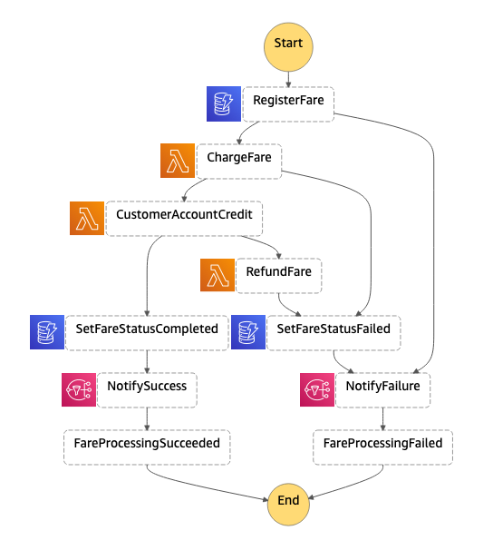

# Lab-4: Choreography and orchestration

AWS Step Functions is a fully managed Serverless workflow management service for managing long running processes and coordinating the components of distributed applications and microservices using visual workflows. But did you know it can also help you deal with the complexities of dealing with a long lived transaction across distributed components in your microservices architecture? In this Builder session, you will learn how AWS Step Function can help us implement the Saga design pattern.

## What problems are we trying to solve?

When building cloud-based distributed architectures, one of the questions we need to ask ourselves is how do we maintain data consistency across microservices that have their own database / persistence mechanism? We do not have support for Distributed Transaction Coordinators (DTC) or two-phase commit protocols responsible for coordinating transactions across multiple cloud resources. We need a mechanism coordinate multiple local transactions.

## What is the Saga Pattern?

A Saga is a design pattern for dealing with “long-lived transactions” (LLT), published by Garcia-Molina and Salem in 1987. Their original paper can be found here [https://www.cs.cornell.edu/andru/cs711/2002fa/reading/sagas.pdf](https://www.cs.cornell.edu/andru/cs711/2002fa/reading/sagas.pdf).

  > “LLT is a saga if it can be written as a sequence of transactions that can be interleaved with other transactions.” (Garcia-Molina, Salem 1987)

Fundamentally it is a failure management pattern, that provides us the means to establish semantic consistency in our distributed applications by providing compensating transactions for every transaction where you have more than one collaborating services or functions.

## Why AWS Step Functions?

AWS Step Functions lets you coordinate multiple AWS services into serverless workflows so you can build and update apps quickly. Using Step Functions, you can design and run workflows that stitch together services, such as AWS Lambda, AWS Fargate, and Amazon SageMaker, into feature-rich applications. Step Functions also provides us with a mechanism for dealing with long-lived transactions, by providing us with the ability to build fully managed state machines that:

* coordinate the components of distributed applications and microservices
* allowing us to build our state machines using visual workflows
* provides us with a way to manage state and deal with failure

# Lab Objective

The core objective for this lab is to build a state machine that implements a Saga for the Wild Rydes Fare Collection process.

The process consists of three discrete transactions that need to be treated as a single, distributed transaction.

1. **Payment Service**: calls payment gateway for credit card pre-authorisation. This is required to charge the customer credit card.
1. **Payment Service**: Make payment. Using the pre-authorisation code, you complete the payment transaction
1. **Customer accounting Service**: once the payment has been processed, update the Wild Rydes Customer accounting system with the transaction details.

**All the functions for the respective services have been provided. You must create the state machine that deals with any failures, and provides compensating transactions that leave the system, and the customers bank account, in a semantically consistent state.** 

These resources are defined in the `template.yaml` file in this project. You can update the template to add AWS resources through the same deployment process that updates your application code.

The template contains two state machine resources `STACK_NAME-start-here` and `STACK_NAME-completed`. Use the "start-here" state machine to begin your work. You can use the completed state machine as a reference if you get stuck. 

You can start editing the state machine directly in the AWS Console, or if you prefer to use an integrated development environment (IDE) to build and test the Lambda functions within your application, you can use the AWS Toolkit. The AWS Toolkit is an open source plug-in for popular IDEs that uses the SAM CLI to build and deploy serverless applications on AWS. The AWS Toolkit also adds a simplified step-through debugging experience for Lambda function code. See the following links to get started:

* [PyCharm](https://docs.aws.amazon.com/toolkit-for-jetbrains/latest/userguide/welcome.html)
* [IntelliJ](https://docs.aws.amazon.com/toolkit-for-jetbrains/latest/userguide/welcome.html)
* [VS Code](https://docs.aws.amazon.com/toolkit-for-vscode/latest/userguide/welcome.html)
* [Visual Studio](https://docs.aws.amazon.com/toolkit-for-visual-studio/latest/user-guide/welcome.html)

The AWS Toolkit for VS Code includes full support for state machine visualization, enabling you to visualize your state machine in real time as you build. The AWS Toolkit for VS Code includes a language server for Amazon States Language, which lints your state machine definition to highlight common errors, provides auto-complete support, and code snippets for each state, enabling you to build state machines faster.

Here is what it should look like once you're done



# Getting started

The Serverless Application Model Command Line Interface (SAM CLI) is an extension of the AWS CLI that adds functionality for building and testing Lambda applications. It uses Docker to run your functions in an Amazon Linux environment that matches Lambda.

To use the SAM CLI, you need the following tools:

* SAM CLI - [Install the SAM CLI](https://docs.aws.amazon.com/serverless-application-model/latest/developerguide/serverless-sam-cli-install.html)
* .NET Core - [Install .NET Core](https://www.microsoft.com/net/download)
* Docker - [Install Docker community edition](https://hub.docker.com/search/?type=edition&offering=community)

To build and deploy your application for the first time, run the following in your shell:

```bash
lab-4$ sam build
lab-4$ sam deploy --guided
```

The first command will build the source of your application. The second command will package and deploy your application to AWS, with a series of prompts:

* **Stack Name**: The name of the stack to deploy to CloudFormation. This should be unique to your account and region, and a good starting point would be something matching your project name.
* **AWS Region**: The AWS region you want to deploy your app to.
* **Confirm changes before deploy**: If set to yes, any change sets will be shown to you before execution for manual review. If set to no, the AWS SAM CLI will automatically deploy application changes.
* **Allow SAM CLI IAM role creation**: Many AWS SAM templates, including this example, create AWS IAM roles required for the AWS Lambda function(s) included to access AWS services. By default, these are scoped down to minimum required permissions. To deploy an AWS CloudFormation stack which creates or modified IAM roles, the `CAPABILITY_IAM` value for `capabilities` must be provided. If permission isn't provided through this prompt, to deploy this example you must explicitly pass `--capabilities CAPABILITY_IAM` to the `sam deploy` command.
* **Save arguments to samconfig.toml**: If set to yes, your choices will be saved to a configuration file inside the project, so that in the future you can just re-run `sam deploy` without parameters to deploy changes to your application.

You can find your API Gateway Endpoint URL in the output values displayed after deployment.

After deployment is complete you can run the following command to retrieve the API Gateway Endpoint URL:

```bash
lab-4$ aws cloudformation describe-stacks \
    --stack-name STACK_NAME\
    --query 'Stacks[].Outputs' \
    --output table
```

## Use the SAM CLI to build and test locally

Build the Lambda functions in your application with the `sam build` command.

```bash
lab4$ sam build
```

The SAM CLI installs dependencies defined in your function folders, creates a deployment package, and saves it in the `.aws-sam/build` folder.

## Add a resource to your application
The application template uses AWS Serverless Application Model (AWS SAM) to define application resources. AWS SAM is an extension of AWS CloudFormation with a simpler syntax for configuring common serverless application resources such as functions, triggers, and APIs. For resources not included in [the SAM specification](https://github.com/awslabs/serverless-application-model/blob/master/versions/2016-10-31.md), you can use standard [AWS CloudFormation](https://docs.aws.amazon.com/AWSCloudFormation/latest/UserGuide/aws-template-resource-type-ref.html) resource types.

## Fetch, tail, and filter Lambda function logs

To simplify troubleshooting, SAM CLI has a command called `sam logs`. `sam logs` lets you fetch logs generated by your deployed Lambda function from the command line. In addition to printing the logs on the terminal, this command has several nifty features to help you quickly find the bug.

`NOTE`: This command works for all AWS Lambda functions; not just the ones you deploy using SAM.

```bash
lab-4$ sam logs -n HelloWorldFunction --stack-name STACK_NAME--tail
```

You can find more information and examples about filtering Lambda function logs in the [SAM CLI Documentation](https://docs.aws.amazon.com/serverless-application-model/latest/developerguide/serverless-sam-cli-logging.html).

## Cleanup

To delete the sample application and the bucket that you created, use the AWS CLI.

```bash
lab-4$ aws cloudformation delete-stack --stack-name STACK_NAME
```

## Resources

See the [AWS SAM developer guide](https://docs.aws.amazon.com/serverless-application-model/latest/developerguide/what-is-sam.html) for an introduction to SAM specification, the SAM CLI, and serverless application concepts.

Next, you can use AWS Serverless Application Repository to deploy ready to use Apps that go beyond hello world samples and learn how authors developed their applications: [AWS Serverless Application Repository main page](https://aws.amazon.com/serverless/serverlessrepo/)
