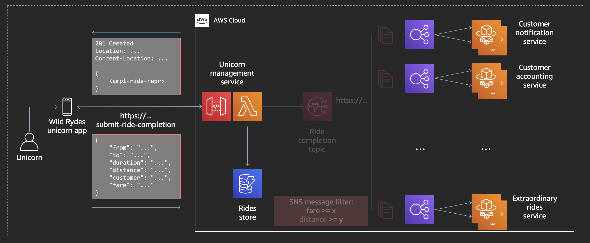
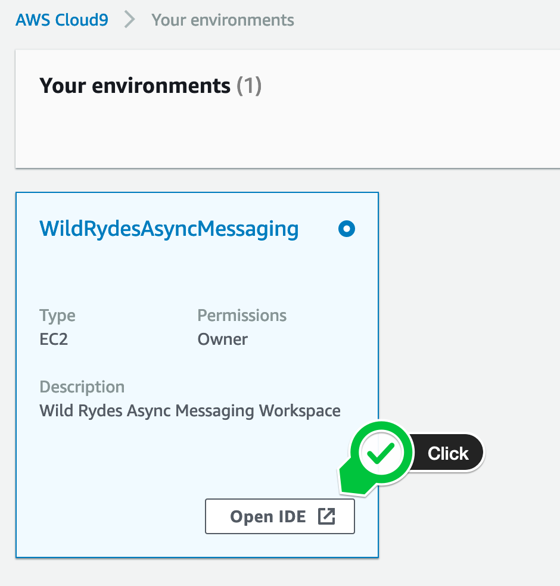
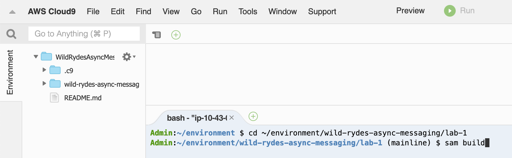
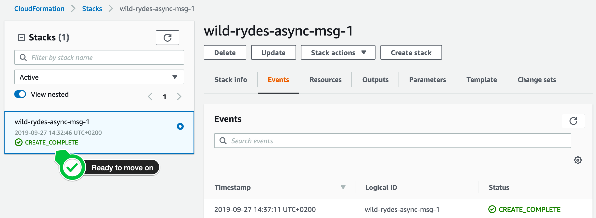

+++
title = "Bootstrap the Initial State"
weight = 21
pre = "1 "
+++

First, we will setup the initial state, including the integrating of the **Unicorn Management Service** (leveraging [Amazon API Gateway](https://aws.amazon.com/api-gateway/) and [AWS Lambda](https://aws.amazon.com/lambda/)), the **Rides Store** (leveraging [Amazon DynamoDB](https://aws.amazon.com/dynamodb/)) and all **3 backend services** listed above (leveraging [AWS Fargate](https://aws.amazon.com/fargate/) behind [Application Load Balancer](https://aws.amazon.com/elasticloadbalancing/)).



#### 1. Browse to your AWS Cloud9 IDE

Browse to your [AWS Cloud9 Console](https://console.aws.amazon.com/cloud9/home) and find the environment called **WildRydesAsyncMessaging**. Click the **Open IDE** button to navigate to your AWS Cloud9 IDE.

{}

{}

#### 2. Build the lab artifacts from source

First, test whether there is already the Amazon ECS service linked role in you account by running the following command in the bash tab (at the bottom) in your AWS Cloud9 IDE:


aws iam get-role --role-name AWSServiceRoleForECS



If this reports an error, please create the Amazon ECS service linked role as described in the hidden section below.

{}
Run the following command in the bash tab in your AWS Cloud9 IDE:

```bash
aws iam create-service-linked-role --aws-service-name ecs.amazonaws.com
```
{}

We provide you with an [AWS SAM](https://aws.amazon.com/serverless/sam/) template which we will use to bootstrap the initial state. In the **bash tab** (at the bottom) in you AWS Cloud9 IDE, run the following commands to build the lab code:  


cd ~/environment/wild-rydes-async-messaging/code/lab-1
sam build


{}

{}

#### 3. Deploy the application

Now we are ready to deploy the application, by running the following command in the **lab-1** directory:  


export AWS_REGION=$(aws --profile default configure get region)
sam deploy \
    --stack-name wild-rydes-async-msg-1 \
    --capabilities CAPABILITY_IAM \
    --region $AWS_REGION \
    --guided


Confirm the first 4 proposed arguments by hitting **ENTER**. When you get asked **SubmitRideCompletionFunction may not have authorization defined, Is this okay? [y/N]:**, enter `y` and hit **ENTER** again 2 times.  

#### 4. Wait until the stack is successfully deployed

It takes usually 4 minutes until the stack launched. You can monitor the progress of the **wild-rydes-async-msg-1** stack in the SAM CLI or in your [AWS CloudFormation Console](https://console.aws.amazon.com/cloudformation). When the stack is launched, the status will change from **CREATE_IN_PROGRESS** to **CREATE_COMPLETE**.

{}

{}


In the meantime while your waiting, you may want to have a look at the AWS SAM template to make yourself familiar with the stack we launched. Just click on the **template.yaml** attachment below to see the content.


{}
