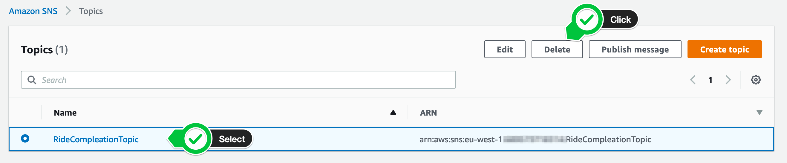

+++
title = "Console"

disableToc = true
hidden = true
+++

#### 3. Delete the Amazon S3 bucket

In your **[Amazon S3 console](https://s3.console.aws.amazon.com/s3/home?#)**, filter for the **bucket** you have created to upload your code artifacts with AWS SAM, select the **bucket** and click the **Delete** button in the top.

{}

{}

#### 4. Delete the Amazon SNS topic

In your **[Amazon SNS console](https://console.aws.amazon.com/sns/v3/home?#/topics)**, select **Topic** in the left navigation pane, select the **RideCompletionTopic** and click the **Delete** button in the top right corner.

{}

{}

You are done!
