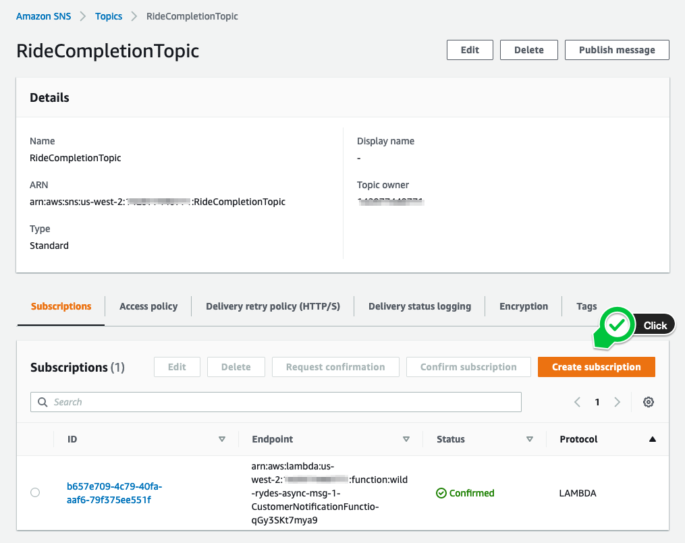
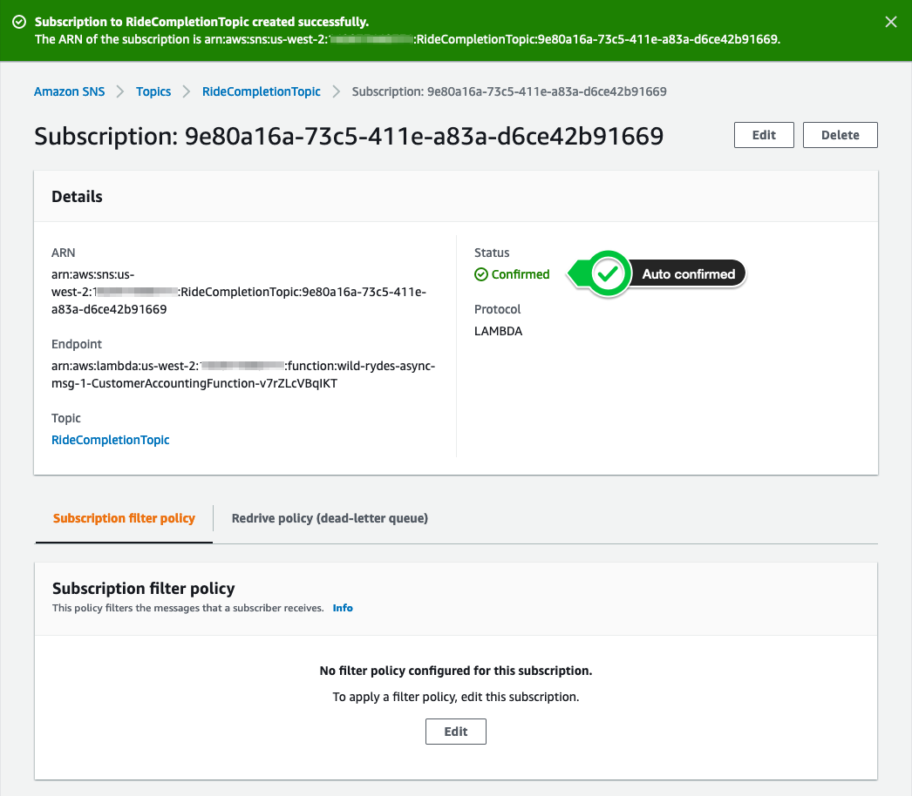

+++
title = "Console"
disableToc = true
hidden = true
+++

#### 1. Create a new subscription

After selecting the topic **RideCompletionTopic**, click the **Create subscription** button in the bottom right corner.

{}

{}

#### 2. Configure the subscription

In the next page, select **HTTP** as the subscription protocol.  

To look-up the subscription endpoint, navigate back to your CloudFormation console, select the stack **wild-rydes-async-msg-1** and select the **Outputs** tab. Select the value, corresponding to the key **CustomerAccountingServiceLBURL**. It should look similar like **http://caslb-...elb.amazonaws.com**.  
You can also look-up the value by running the following command:  
```bash
aws cloudformation describe-stacks \
    --stack-name wild-rydes-async-msg-1 \
    --query 'Stacks[].Outputs[?OutputKey==`CustomerAccountingServiceLBURL`].OutputValue' \
    --output text
```

Click **Create subscription** to create the subscription.

{}

{}


#### 3. Confirm the subscription

**Amazon SNS** require a confirmation of a subscription, before it publishes messages to that endpoint, as described **[here](https://docs.aws.amazon.com/sns/latest/dg/sns-http-https-endpoint-as-subscriber.html#SendMessageToHttp.confirm)**.  
Our provided Customer Notification Service handles this automatically for us. The **Status** will change to **Confirmed** immediately (may refresh the page a couple of times). There is nothing to do for you in this step.  

{}

{}
