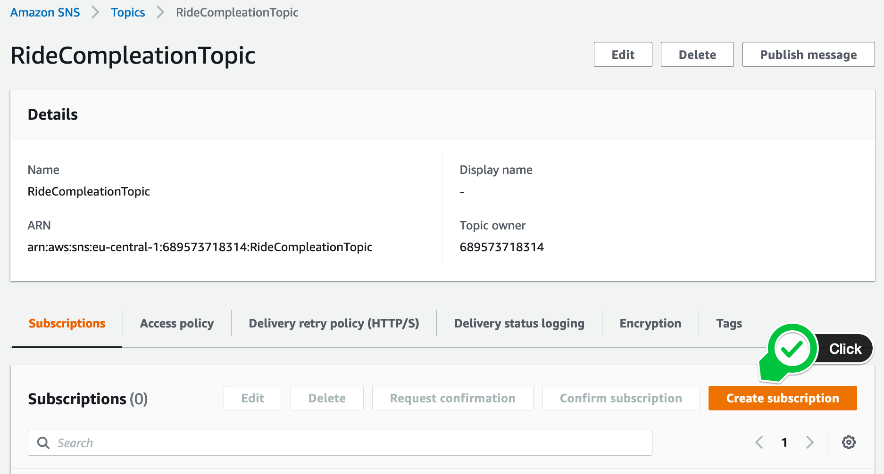
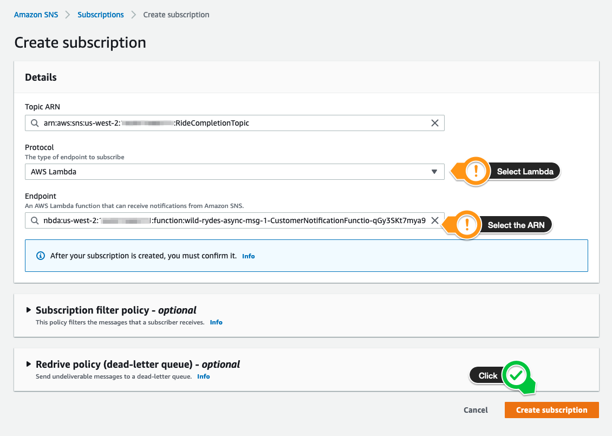
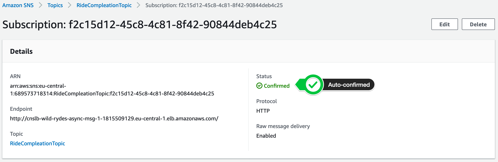
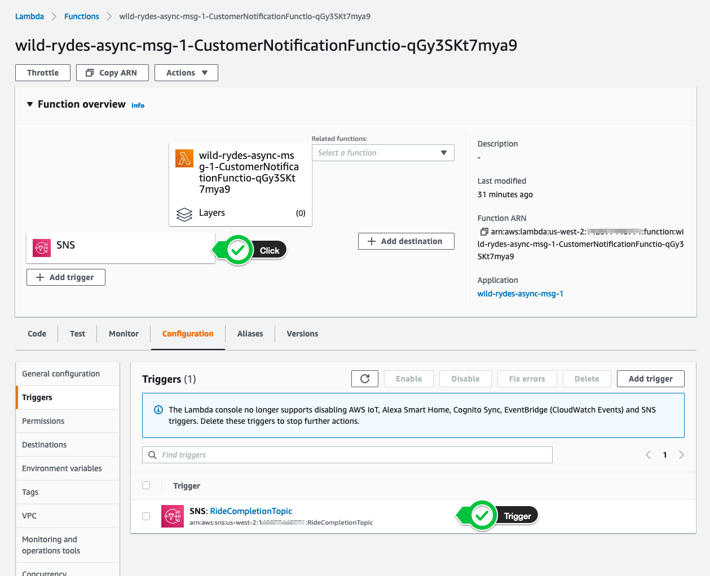

+++
title = "Console"
disableToc = true
hidden = true
+++

#### 1. Create a new subscription

After selecting the topic **RideCompletionTopic**, click the **Create subscription** button in the bottom right corner.

{}

{}

#### 2. Configure the subscription

In the next page, select **AWS Lambda** as the subscription protocol.  In the **Endpoint** dropdown type **CustomerNotification**, and select the ARN of the Lambda function.

To look-up the subscription endpoint, navigate back to your CloudFormation console, select the stack **wild-rydes-async-msg-1** and select the **Outputs** tab. Select the value, corresponding to the key **CustomerNotificationFunction**. It should look similar like `arn:aws:lambda...CustomerNotificationFunctio-qGy9SKt8mya6`.  

You can also look-up the value by running the following command:

```bash
aws cloudformation describe-stacks \
    --stack-name wild-rydes-async-msg-1 \
    --query 'Stacks[].Outputs[?OutputKey==`CustomerNotificationFunction`].OutputValue' \
    --output text
```

Click **Create subscription** to create the subscription.

{}

{}

#### 3. Confirm the subscription

Amazon SNS and AWS Lambda are integrated so the subscription is immediately established and the **Status** will change to **Confirmed**. There is nothing to do for you in this step.  

{}

{}

To validate that the trigger was created for the Lambda function, navigate to the [AWS Lambda console](https://console.aws.amazon.com/lambda/home?/functions). Open the **Customer Notification function**. In the function overview you should see the SNS service icon. Click on the icon and make sure you have the **RideCompletionTopic** trigger listed.

{}

{}