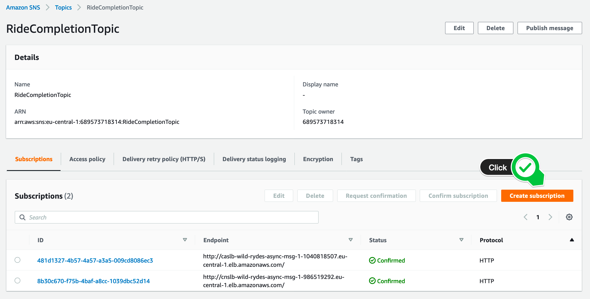
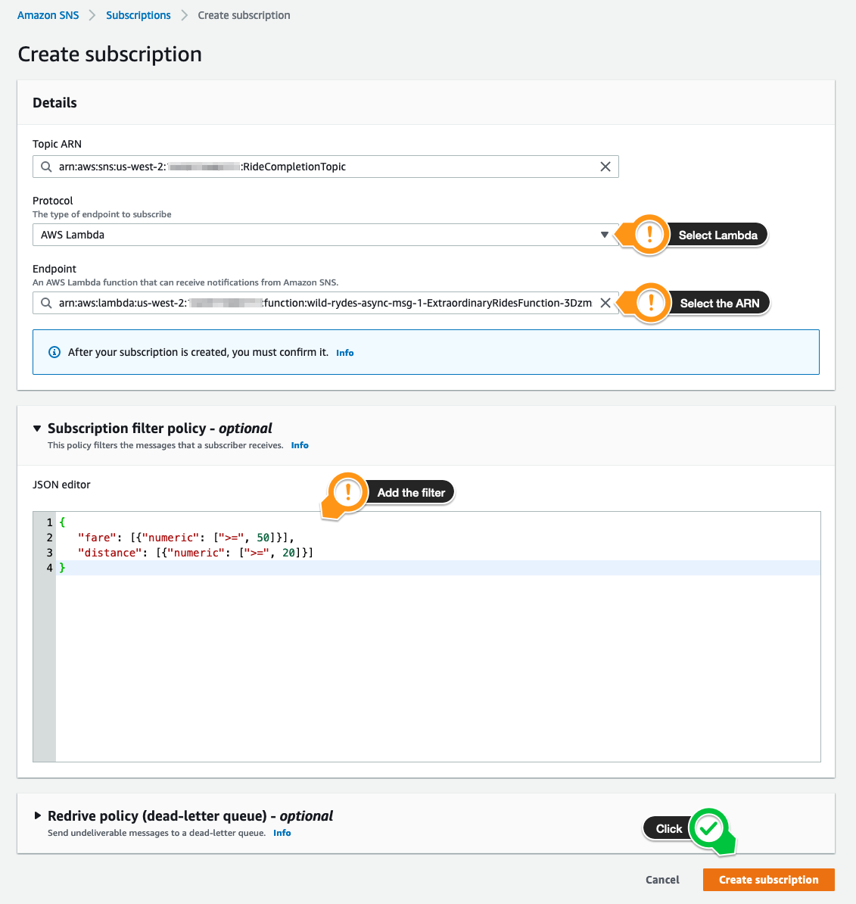
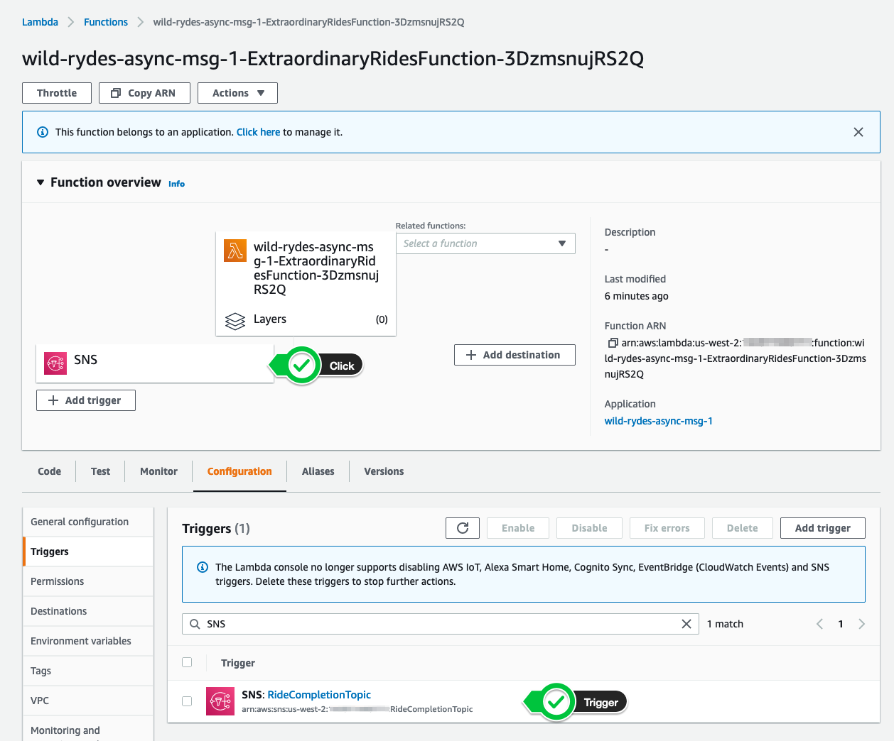

+++
title = "Console"
disableToc = true
hidden = true
+++

#### 1. Create a new subscription

After selecting the topic **RideCompletionTopic**, click the **Create subscription** button in the bottom right corner.

{}

{}

#### 2. Configure the subscription

In the next page, select **AWS Lambda** as the subscription protocol.  In the **Endpoint** dropdown type **CustomerNotification**, and select the ARN of the Lambda function.

To look-up the subscription endpoint, navigate back to your CloudFormation console, select the stack **wild-rydes-async-msg-1** and select the **Outputs** tab. Select the value, corresponding to the key **ExtraordinaryRidesFunction**. It should look similar like `arn:aws:lambda...ExtraordinaryRidesFunction-3DzmsnujRS2Q`.  

You can also look-up the value by running the following command:

```bash
aws cloudformation describe-stacks \
    --stack-name wild-rydes-async-msg-1 \
    --query 'Stacks[].Outputs[?OutputKey==`ExtraordinaryRidesFunction`].OutputValue' \
    --output text
```

{}
Don't overlook to create the subscription filter policy!
{}

Expand the section **Subscription filter policy** to create the subscription filter policy to receive notifications only, if the `fare >= 50` and the `distance >= 20`. If you are not familiar with the syntax, you can study it [here](https://docs.aws.amazon.com/sns/latest/dg/sns-subscription-filter-policies.html) - or fall-back to the cheat sheet below.  

{}
```
{
   "fare": [{"numeric": [">=", 50]}],
   "distance": [{"numeric": [">=", 20]}]
}
```
{}

Click **Create subscription** to create the subscription.

{}

{}


#### 3. Confirm the subscription

**Amazon SNS** require a confirmation of a subscription, before it publishes messages to that endpoint, as described **[here](https://docs.aws.amazon.com/sns/latest/dg/sns-http-https-endpoint-as-subscriber.html#SendMessageToHttp.confirm)**.  
Our provided Customer Notification Service handles this automatically for us. The **Status** will change to **Confirmed** immediately (may refresh the page a couple of times). There is nothing to do for you in this step.  

{}

{}

To validate that the trigger was created for the Lambda function, navigate to the [AWS Lambda console](https://console.aws.amazon.com/lambda/home?/functions). Open the **Extraordinary Rides function**. In the function overview you should see the SNS service icon. Click on the icon and make sure you have the **RideCompletionTopic** trigger listed.

{}

{}