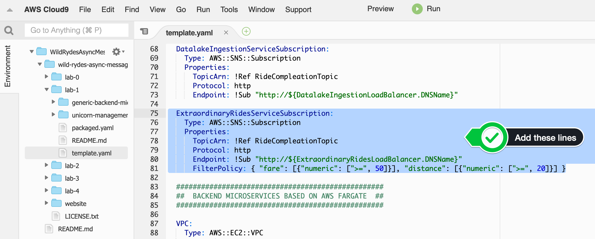

+++
title = "SAM"
disableToc = true
hidden = true
+++

#### 1. Update the AWS SAM template

In your Cloud9 IDE for this workshop, open the SAM template file 'wild-rydes-async-messaging/lab-1/template.yaml'. In the **Resources** section, add the definition for the Amazon SNS subscription for the **ExtraordinaryRidesService**. You can find the AWS CloudFormation documentation to do so **[here](https://docs.aws.amazon.com/AWSCloudFormation/latest/UserGuide/aws-resource-sns-subscription.html)**.

{}
Don't overlook to create the subscription filter policy!
{} 

{}
```yaml
Events:
  SNSEvent:
    Type: SNS
    Properties:
      Topic: !Ref RideCompletionTopic
      FilterPolicy:
        fare:
          - numeric:
              - '>='
              - 50
        distance:
          - numeric:
              - '>='
              - 20
```
{}

{}

{}


#### 2. Deploy the updated AWS SAM template

Run the following command to build the lab again, after we have added the Amazon SNS subscription:


cd ~/environment/wild-rydes-async-messaging/lab-1
sam build


Now we are ready to update the application, by running the following command to deploy the change:  


sam deploy


**Note:** you do not need to provide the arguments for the deployment, because AWS SAM saved the parameter values in a configuration file called **samconfig.toml**. See the **[documentation](https://docs.aws.amazon.com/serverless-application-model/latest/developerguide/serverless-sam-cli-config.html)** more information on the AWS SAM CLI configuration file.

Because AWS SAM will only deploy/update/delete resources which are changed, it only takes a couple of seconds to deploy the new Amazon SNS topic.