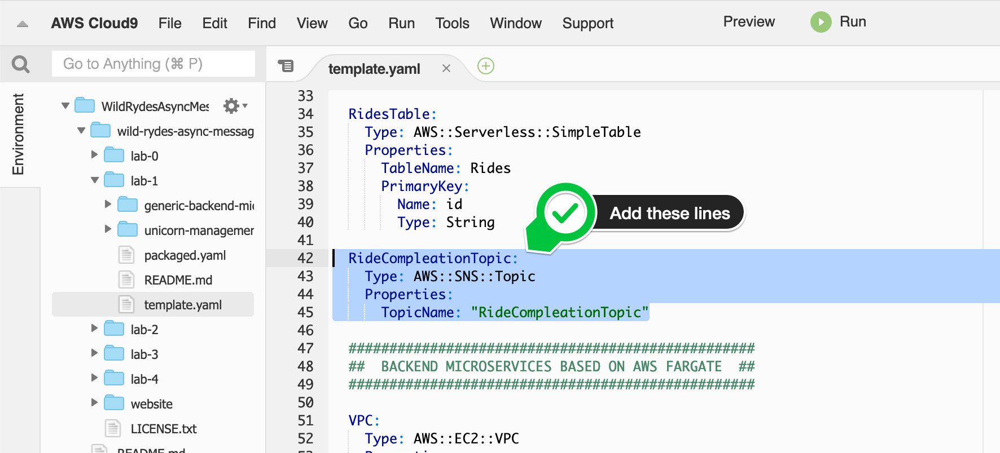

+++
title = "SAM"

disableToc = true
hidden = true
+++

#### 1. Update the AWS SAM template

In your Cloud9 IDE for this workshop, open the SAM template file `wild-rydes-async-messaging/lab-1/template.yaml`. In the **Resources** section, add the definition for an Amazon SNS topic with the name RideCompletionTopic. You can find the AWS CloudFormation documentation to do so **[here](https://docs.aws.amazon.com/AWSCloudFormation/latest/UserGuide/aws-properties-sns-topic.html)**.

{}
```
  RideCompletionTopic:
    Type: AWS::SNS::Topic
    Properties:
      TopicName: RideCompletionTopic
```
{}

{}

{}


#### 2. Deploy the updated AWS SAM template

Run the following command to build the lab again, after we have added the Amazon SNS topic:


cd ~/environment/wild-rydes-async-messaging/code/lab-1
sam build




Now we are ready to update the application, by running the following command to deploy the change:  


sam deploy \
    --guided \
    --stack-name wild-rydes-async-msg-1 \
    --capabilities CAPABILITY_IAM


Confirm the first 4 proposed arguments by hitting **ENTER**. When you get asked **SubmitRideCompletionFunction may not have authorization defined, Is this okay? [y/N]:**, enter `y` and hit **ENTER** again 2 times.  

Because AWS SAM will only deploy/update/delete resources which are changed, it only takes a couple of seconds to deploy the new Amazon SNS topic.
