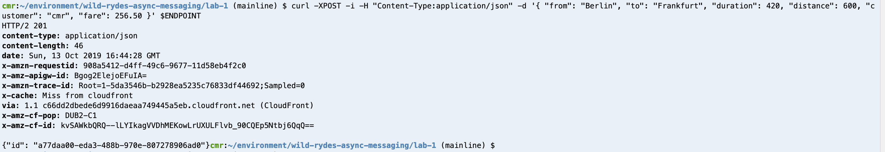
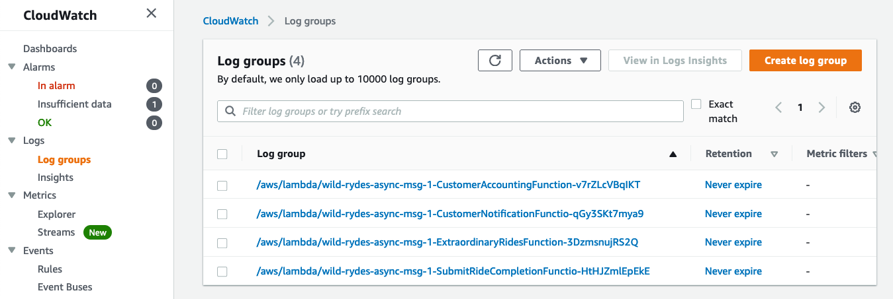
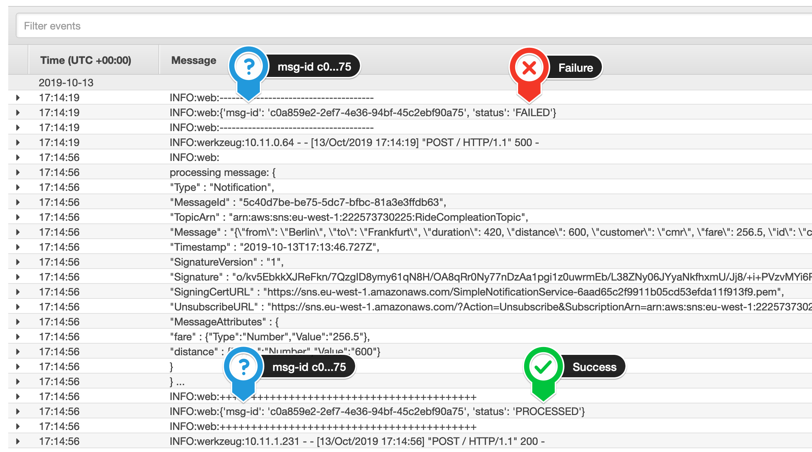

+++
title = "Test Fan-Out and Message Filtering"

weight = 27
pre = "7 "
+++

In this step, we will validate that the Amazon SNS topic is publishing all messages to all subscribers. Because a subscriber can also fail processing a message, we also want to validate that Amazon SNS is redelivering the message, so that we will not miss a single message.

#### 1. Look up the API Gateway endpoint

To look-up the API Gateway endpoint URL for the submit-ride-completion function, run the following command:  

```bash
aws cloudformation describe-stacks \
    --stack-name wild-rydes-async-msg-1 \
    --query 'Stacks[].Outputs[?OutputKey==`UnicornManagementServiceApiSubmitRideCompletionEndpoint`].OutputValue' \
    --output text
```


#### 2. Send a couple requests to the Unicorn Management Service

Let's store this API Gateway endpoint URL in an environment variable, so we don't have to repeat it all the time:

```bash
export ENDPOINT=$(aws cloudformation describe-stacks \
    --stack-name wild-rydes-async-msg-1 \
    --query 'Stacks[].Outputs[?OutputKey==`UnicornManagementServiceApiSubmitRideCompletionEndpoint`].OutputValue' \
    --output text)
```

To send a couple requests to the **submit ride completion endpoint**, execute the command below 5 or more times and change the request payload to test the filter criteria for the **Extraordinary Rides Service**:  

```bash
curl -XPOST -i -H "Content-Type:application/json" -d '{ "from": "Berlin", "to": "Frankfurt", "duration": 420, "distance": 600, "customer": "cmr", "fare": 256.50 }' $ENDPOINT
```

{}

{}


#### 3. Validate the message reception

Go to your [Amazon CloudWatch Log console](https://console.aws.amazon.com/cloudwatch/home?#logStream:group=ecs/wild-rides/async-msg) and your **Log Group** `ecs/wild-rides/async-msg`. Select the Log Group to see all **Log Streams** available for this Log Group.

{}

{}

Browse each Log Stream to validate, that each of our 3 backend service could successfully process the message. You should also see some random log entries, indicating a failed message processing. Shortly after, you should see the message redelivery from Amazon SNS and the successful message processing log entry.  

{}

{}
