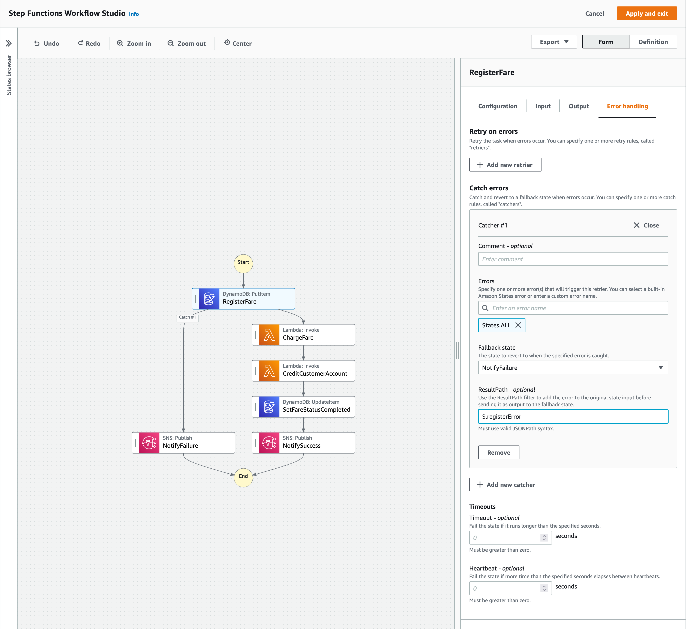
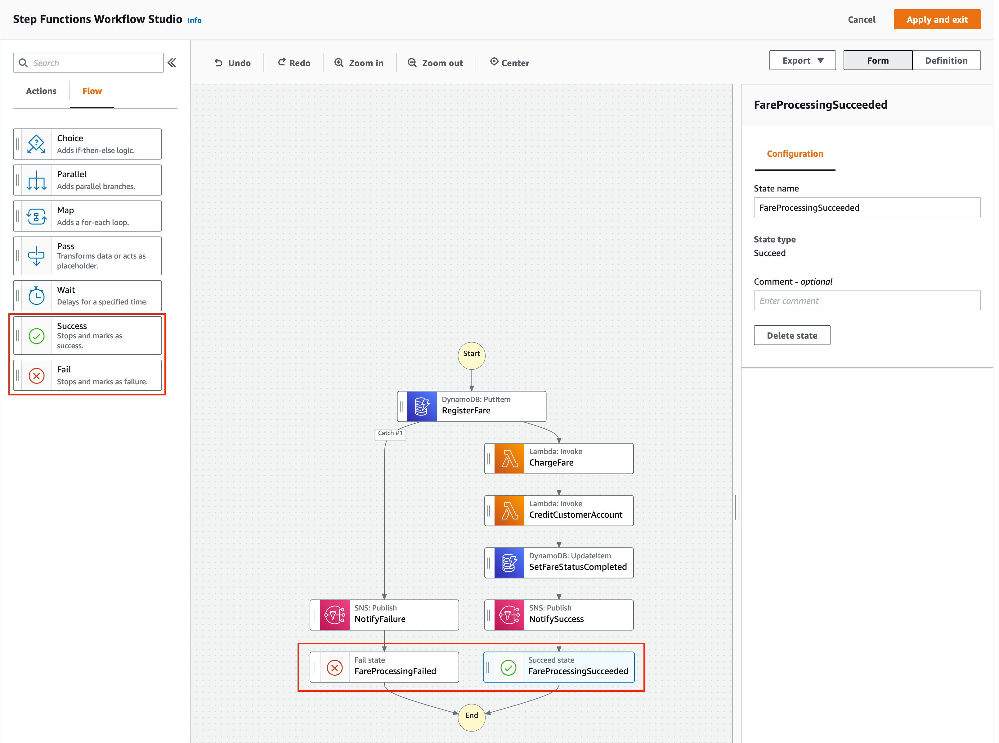
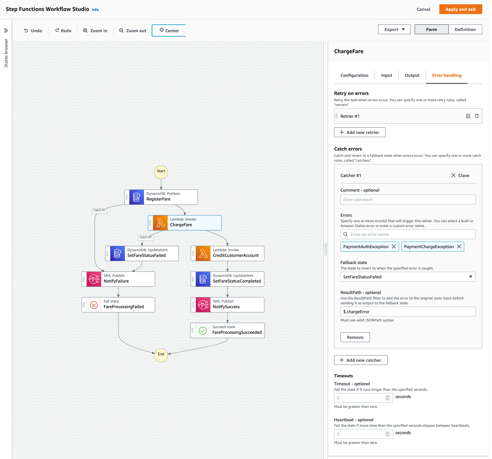
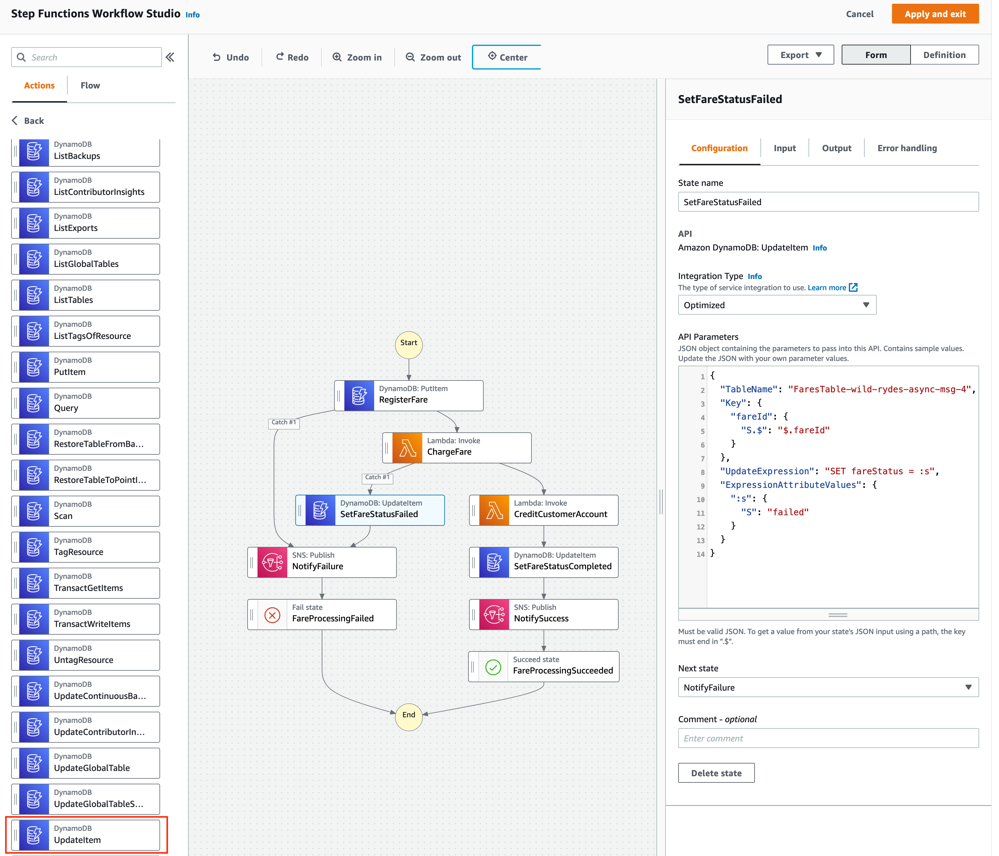
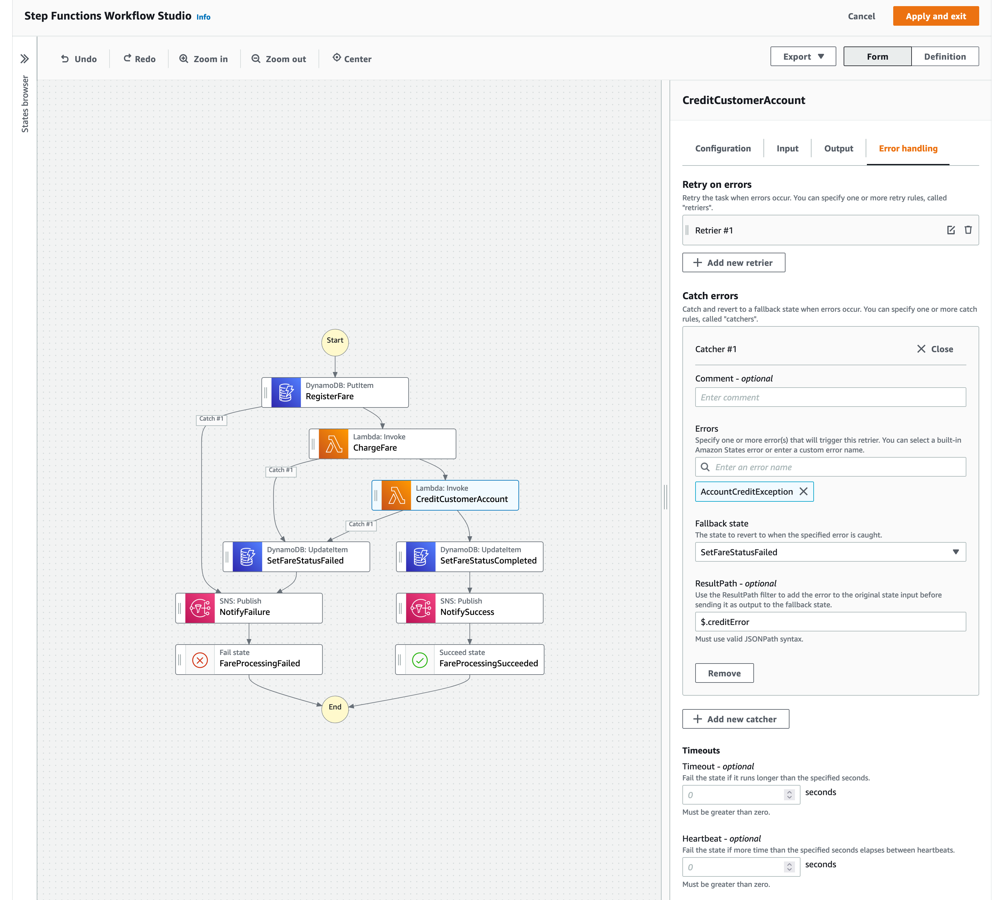
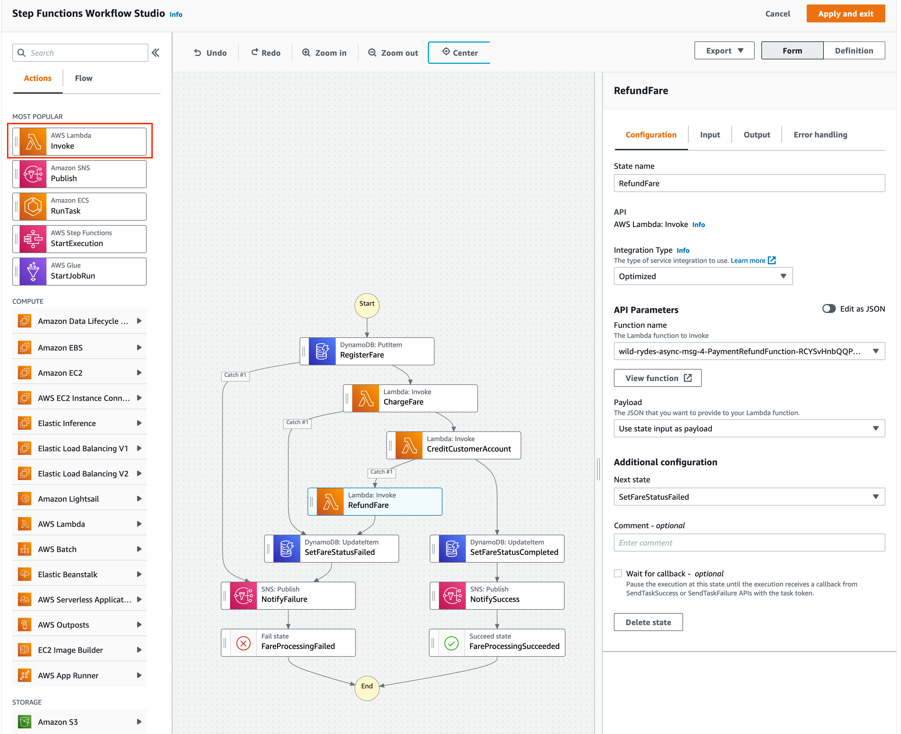

+++
title = "Add Exception Handling"
weight = 53
pre = "4 "
+++

#### 1. Error Handling

In the last section, we added the transactions required to register and charge a fare and credit a customer account. But what if a problem occurs with any of these transactions? 

Remember that we need to leave the state of the system in a semantically correct state at each stage of the workflow. We wouldn't want to charge a fare via a payment system only for something to go wrong and then incorrectly credit a customer account. Similarly, we wouldn't want to mark a fare as completed without successfully taking payment. Our Unicorns might be magic but our profits are not!

In this section, we will add logic to catch potential failures at each state in the workflow. This will enable us to rollback the transactions in order to leave the state of the system in a semantically correct state. We will also add termination states for both successful and unsuccessful State machine executions and an additional notification for unsuccessful completions.

#### 1. Step Functions Error Handling

Any state in a Step Functions state machine can encounter an error and errors can happen for a variety of reasons:

* State machine definition issues (e.g. no matching rule in a Choice state)
* Task failures (e.g. an exception in a Lambda function)
* Transient issues (e.g. transient throttling or network issues)

**By default, when a state reports an error, AWS Step Functions will fail the execution entirely.**

However in addition to this default error behaviour, the **Task, Map and Parallel** states in a Step Functions State machine allow errors to be caught using the **Catch** field (also referred to as a **Catcher**). This enables conditional logic based on the error and in turn enables customisable error handling within a Step Functions state machine.

The Catch field enables all or specific errors to be caught by specifying error names in the **errors** field. Error names can be custom errors raised by Lambda functions or errors defined by a particular AWS service. Step Functions provides a number of [default error names](https://docs.aws.amazon.com/step-functions/latest/dg/concepts-error-handling.html#error-handling-error-representation)
, a selection of which are:

* States.ALL - Acts as a catch all and matches any known error name.
* States.Timeout - Thrown when a Task state runs for longer than the **TimeoutSeconds** value or failed to send a heartbeat for a period longer than the **HeartbeatSeconds** value.
* States.TaskFailed - Acts as a wildcard for any error other than **States.Timeout**.

In the event an error is caught, a **fallback state** is defined as part of a **Catcher** which determines the next state to transition to, together with a **ResultPath** that enables the error to be appended to the original input to in turn allow down stream systems and processes to take appropriate action. 

{}
We use a **Catcher** and add the error name to the **ResultPath** in this lab to send an error SNS failure notification with the details of the specific error that occurred.
{}

#### 2. RegisterFare Exception Handling & Failure Notification

Let's start by adding some error handling to our first state: **RegisterFare**. 

This is a relatively simple state that adds a new Fare item to our DynamoDB table using Step Functions direct integration with DynamoDB. 

Click on the **RegisterFare** state in the graph and select the **Error Handling** table from the **Form** view. Click **Add new catcher**.

For this state, our behavior is not going to vary by error, we will simply send a failure notification in each case, so let's catch all possible exceptions. We can do this by specifying the **States.ALL** error name in the **Errors** text box. Add **$.registerError** to the **ResultPath** field for the catcher.

For the **Fallback state** option, choose **Add new state**. This creates an empty state that our catcher will transition to in the event of a failure. In the **Actions** menu in the left-hand pane, select **Amazon SNS Publish** from either the **Most Popular** or **Application Integration** category and drag onto the empty state. 

Set the parameters for the **SNS Publish** state as follows (leave the others with default values):

* **State Name**: NotifyFailure
* **Topic**: Search for the bootstrapped SNS topic containing the string **FareProcessing**. Copy the Topic ARN and keep to hand.

Click on **Edit as JSON** under **API Parameters** and copy the following JSON replacing **arn placeholder** with the topic ARN you copied previously: 


{
  "Message.$": "$",
  "TopicArn": "<<arn placeholder>>",
  "MessageAttributes": {
    "IsSuccessful": {
      "DataType": "String",
      "StringValue": "false"
    }
  }
}

In the **Output** tab, ensure the **Add original input to output using ResultPath** is ticked and has the following values:

* Combine original input with result
* $.snsResult

You should now have two execution flows within your State Machine, the original successful path and an additional path that is followed in the event of a failure when Registering a Fare that leads to an SNS Failure Notification.

{}

{}

{}
Before you move on to the next step, can you predict a potential issue with the State machine and the two execution flows as it stands?
{}

#### 3. Managing Execution State

Whilst we send SNS notifications to distinguish whether our State machine completed successfully or failed, the Step Functions **execution status** will return successful for both a successful execution and for executions where an error at the **RegisterFare** state is caught (remember we are catching *all* errors). This is undesirable as we may want to track successful vs unsuccessful executions and we may also want to use the State machine execution status to determine follow on actions. 

Let's add a **Succeed and Fail state** to the end of each flow to appropriately denote the execution status.

In the **Flow** menu in the left-hand pane, drag the **Success** Flow state in between the **NotifySuccess** and **End** states. Set the **StateName** to **FareProcessingSucceeded**.

Repeat the process for the **Fail** Flow state and drag in between **NotifyFailure** and **End**. Set the **StateName** to **FareProcessingFailed**.

{}
The Success and Fail states are also useful for terminating a flow of execution early, perhaps as part of a **Choice** state branch where no further processing is necessary.
{}

{}

{}

#### 4. ChargeFare Exception Handling

Next, let's add a **Catcher** to the **ChargeFare** state.

It is important to understand the errors that can potentially occur in your Lambda Function when defining a catcher. 
For AWS Lambda, there are [two types of error](https://docs.aws.amazon.com/lambda/latest/dg/invocation-retries.html) that can occur: **Invocation errors** and **Function errors**. 

* Invocation errors occur when an invocation request is rejected before your Function receives it. This might occur because of a concurrency limit being reached, lack of permissions, or a malformed request event.

* Function errors are further sub divided into those that your function code throws and those that can occur at the runtime level. Runtime errors are thrown by the Lambda Service and can occur when your function exceeds the configured timeout, detects a syntax error, fails to marshall a JSON response and so on.

To determine the Function errors for **ChargeFare** we will look at the underlying Lambda function code. The easiest method is to examine the **ChargeFare** Lambda Function code directly through the Lambda console. Click on the **ChargeFare** state and then **View Function** in the **Configuration** tab.

Notice in the **PaymentChargeFunction** code that underpins our **ChargeFare** state that we define two exceptions at the top:
* PaymentAuthException - thrown when payment cannot be authorised.
* PaymentChargeException - thrown when the payment cannot be charged.

We will add a catcher to catch both of these exceptions. Back in the **Step Functions Workflow Studio**, Select the **ChargeFare** state and navigate to the **Error Handling** table and click **Add new Catcher**. Add the following values (add each error as a separate value excluding the commas):

* **Errors**: PaymentAuthException, PaymentChargeException
* **ResultPath**: $.chargeError

For the **Fallback State**, let's take the opportunity to leave our system in a semantically correct state and rather than just sending a failure notification, we will add a new state to set the Fare status to failed. Select **Add new state** as the target for our new catcher and drag a **DynamoDB UpdateItem** action onto the new empty state.

For the new **DynamoDB UpdateItem** action, add the following values:

* **StateName**: SetFareStatusFailed
* **API Parameters**:
    
{
  "TableName": "FaresTable-wild-rydes-async-msg-4",
  "Key": {
    "fareId": {
      "S.$": "$.fareId"
    }
  },
  "UpdateExpression": "SET fareStatus = :s",
  "ExpressionAttributeValues": {
    ":s": {
      "S": "failed"
    }
  }
}
* **NextState**: **NotifyFailure**

In the **Output** tab for the new **DynamoDB UpdateItem** action, ensure the **Add original input to output using ResultPath** is ticked and has the following values:

* Combine original input with result
* $.dynamodbResult

You should now have a catcher defined for **ChargeFare** which falls back to the newly added **SetFareStatusFailed** state. Refer to the Detailed Description to verify your state machine.

{}

{}

#### 5. CreditCustomerAccount Exception Handling

Next let's add exception handling to the **CreditCustomerAccount** state. 

Take an opportunity to again look at the Lambda function code underpinning this state and the exceptions thrown by this code. You will notice that a single exception is thrown: **AccountCreditException**.

In the **Step Functions Workflow Studio**, select the **CreditCustomerAccount** state and click on the **Error Handling** tab. Click **Add new catcher** and add the following values:

* **Errors**: AccountCreditException
* **Fallback state**: SetFareStatusFailed
* **ResultPath**: $.creditError

{}

{}

#### 6. Refund Customer Account

After the last step, we are catching the **AccountCreditException** and then setting the fare status to failed followed by a failure notification. However, we have not dealt with the fact that we have charged the customer for the fare prior to this state and therefore in this exceptional execution case, we have potentially left our system in an inconsistent state.

To resolve this, we need to rollback the ChargeFare transaction and we will do this by refunding the customer in the event of a **AccountCreditException**. 

In the **Step Functions Workflow Studio**, drag the **AWS Lambda Invoke** Action onto the State machine graph inbetween **CreditCustomerAccount** and **SetFareStatusFailed** over the top of the **Catch #1** label. Add the following values:

* **StateName**: RefundFare
* **Function Name**: Search for **PaymentRefundFunction**
* **Next State**: SetFareStatusFailed (should be implicitly set)

{}

{}

#### 7. Exception Handling Complete

This completes this step in the lab. We have added exception handling, ensuring transactions are rolled back, notifications are sent and the status of the State machine execution matches the notification and fare status. Good work!
