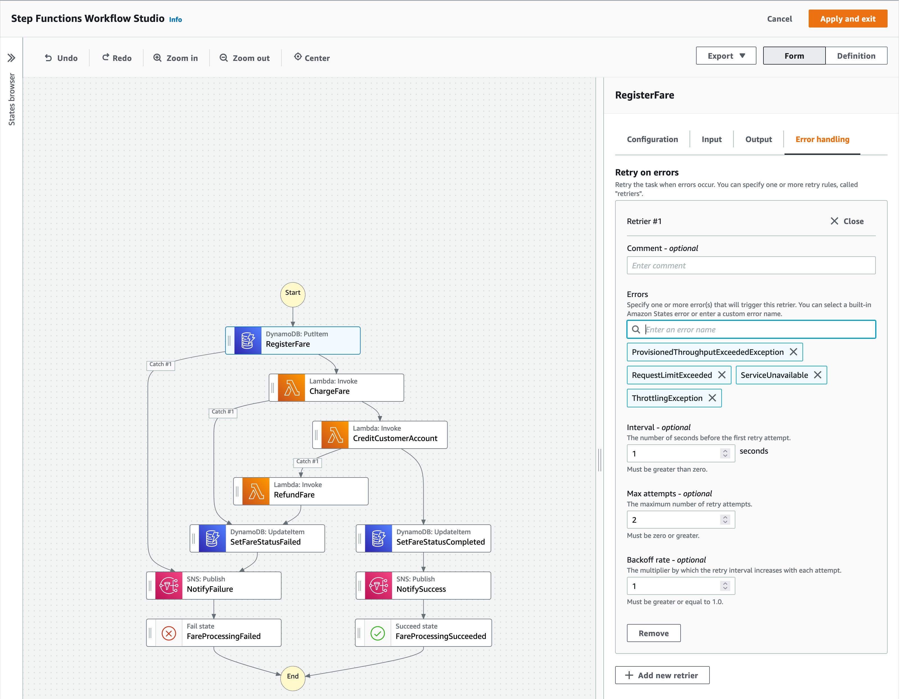

+++
title = "Add Retrying"
weight = 54
pre = "5 "
+++

#### 1. Step Functions Retry

In addition to **Catchers**, the **Task and Parallel** states can also define a **Retry** (also referred to as **Retriers**). A Retry can be used to define one or more retriers with each retrier representing a certain number of retries, usually with increasing time intervals.

A Retrier has the following fields:
* Errors - this determines the error names to match that triggers a retrier.
* Interval - an integer that represents the number of seconds before the first retry attempt (1 by default).
* Max Attempts - the maximum retry attempts (default: 3).
* Backoff Rate - the multiplier by which the retry interval increases during each attempt (default: 2.0).

### 2. RegisterFare Retry

Let's add a Retrier to the **RegisterFare** state.

When we looked at adding Catchers for our States that are backed by Lambda Functions, we examined the code and the Lambda service for potential exceptions that can occur. **RegisterFare** is a state which integrates directly with DynamoDB to add a Fare item. We can look at the errors that [DynamoDB throws](https://docs.aws.amazon.com/amazondynamodb/latest/developerguide/Programming.Errors.html#Programming.Errors.Components) to determine what we need to match and how we should proceed in terms of retries.

In this step, we will add a Retrier for the transient DynamoDB exceptions that have the potential to be successful when retried.

Navigate to **Workflow Studio** and click on the **RegisterFare** state. Select the **Error Handling** tab and click on **Add new retrier**. 

Add the following values for the retrier (add each error as a separate value excluding the commas):

* Errors: ProvisionedThroughputExceededException, RequestLimitExceeded, ServiceUnavailable, ThrottlingException
* Interval: 1
* Max attempts: 2
* Backoff rate: 2

{}

{}

### 3. Repeat for Set Fare Status states

Repeat the steps above to add retriers for the **SetFareStatusFailed** and **SetFareStatusCompleted** states which are also DynamoDB integrations.