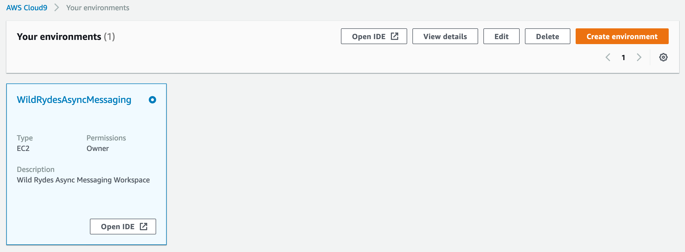
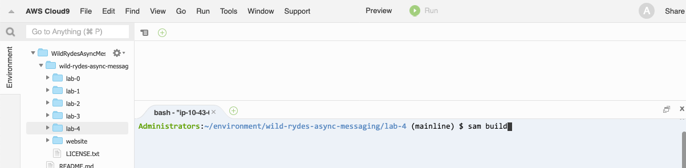
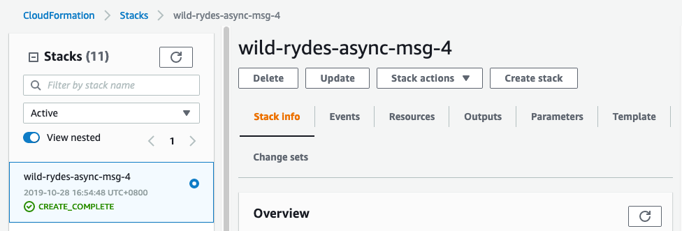

+++
title = "Bootstrap the Initial State"
weight = 50
pre = "1 "
+++

### 1. Browse to your AWS Cloud9 IDE

Browse to your [AWS Cloud9 Console](https://console.aws.amazon.com/cloud9/home) and select the environment called **WildRydesAsyncMessaging**.

{}

{}

### 2. Build the lab artifacts from source

We provide you with an [AWS SAM](https://aws.amazon.com/serverless/sam/) template which we will use to bootstrap the initial state. In the **bash tab** (at the bottom) in you AWS Cloud9 IDE, run the following commands to build the lab code:  


cd ~/environment/wild-rydes-async-messaging/lab-4
sam build


{}

{}

### 3. Deploy the application

Now we are ready to deploy the application, by running the following command in the **lab-4** directory:  


export AWS_REGION=$(aws --profile default configure get region)
sam deploy \
    --stack-name wild-rydes-async-msg-4 \
    --capabilities CAPABILITY_IAM \
    --region $AWS_REGION \
    --guided


Confirm all proposed arguments by hitting **ENTER**.

### 4. Wait until the stack is successfully deployed

It takes usually 4 minutes until the stack launched. You can monitor the progress of the **wild-rydes-async-msg-4** stack in your [AWS CloudFormation Console](https://console.aws.amazon.com/cloudformation). When the stack is launched, the status will change from **CREATE_IN_PROGRESS** to **CREATE_COMPLETE**.

{}

{}
