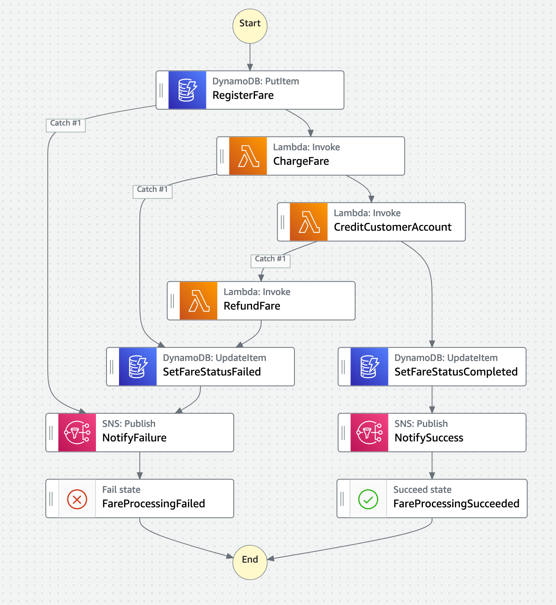

+++
title = "Build Guide"
weight = 52
pre = "2 "
+++

Once you have bootstrapped this workshop, you will be presented with AWS Step Function State Machine, as a starting point `wild-rydes-async-msg-4`. The bootstrap created two state machine resources `wild-rydes-async-msg-4-start-here` and `wild-rydes-async-msg-4-completed`. Use the **"wild-rydes-async-msg-4start-here"** state machine to begin your work. You can use the completed state machine as a reference if you get stuck.

The AWS Lambda functions, Amazon DynamoDB table, and Amazon SNS topic with Amazon SQS subscriptions have been created for you during the bootstrapping process, and you can find their resources in the AWS CloudFormation Output panel.

{}
**TASK: You must create the state machine** that integrates these services and deals with any failures by providing compensating transactions that leave the system, and the customer's bank account, in a semantically consistent state.
{}

This is what the should look like once complete.

#### Defining the state machine with Amazon States Language

Below is a list of States and tasks in the state machine. Use this to help you compose your state machine definition.

| State name | Task type | Description |
| ---------- | --------- | ----------- |
| RegisterFare | DynamoDB Service Integration | Insert item via Amazon DynamoDB Service Integration | 
| ChargeFare | Task | Invoke an AWS Lambda function (call directly via the "Resource" string) |
| CustomerAccountCredit | Task | Invoke an AWS Lambda function (call directly via the "Resource" string) |
| SetFareStatusCompleted | DynamoDB Service Integration | Update item via Amazon DynamoDB Service Integration |
| SetFareStatusFailed | DynamoDB Service Integration | Update item via Amazon DynamoDB Service Integration |
| NotifySuccess | SNS Service Integration | Publish event via Amazon SNS Service Integration |
| NotifyFailure | SNS Service Integration | Publish event via Amazon SNS Service Integration |
| FareProcessingFailed | Fail | Failed state |
| FareProcessingSucceeded |  Succeed | Succeed State |

A full description of the how to describe your state machine can be found on the [Amazon States Language specification](https://states-language.net/spec.html).

{}
See the Output for the CloudFormation stack for ARN for the AWS Lambda functions, Amazon DynamoDB table, Amazon SNS topic, and Amazon SQS queues. Alternatively, you can run the CloudFormation command below.
{}


aws cloudformation describe-stacks \
    --stack-name wild-rydes-async-msg-4 \
    --query 'Stacks[].Outputs'



{}
Try the **Generate code snippet** dropdown in the AWS Step Function Editor in the [AWS Console](https://console.aws.amazon.com/states/home) for examples of how you can implement various states

{}
