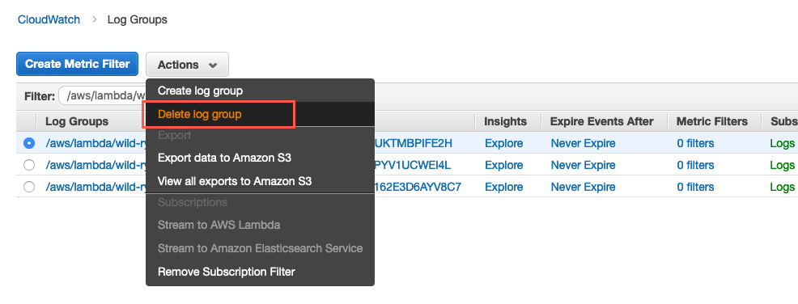

+++
title = "Clean up"
weight = 54
pre = "4 "
+++

In this step, we will clean up all resources, we created during this lab, so that no further cost will occur.

#### 1. Delete the AWS SAM template

In your Cloud9 IDE, run the following command to delete the resources we created with our AWS SAM template:


cd ~/environment/wild-rydes-async-messaging/lab-4
aws cloudformation delete-stack \
    --stack-name wild-rydes-async-msg-4


#### 2. Delete the AWS Lambda created Amazon CloudWatch Log Group

Follow **[this deep link](https://console.aws.amazon.com/cloudwatch/home?#logs:prefix=/aws/lambda/wild-rydes)** to list the **Amazon CloudWatch Log Groups** with the name `/aws/lambda/wild-rydes`, AWS Lambda created during this lab. Select the Amazon CloudWatch Log Group and choose **Delete log group** from the **Actions** menu. Repeat for remaining Log Groups.

{}

{}

#### 2. Delete other resources




