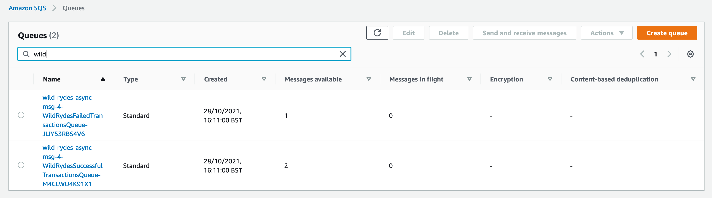
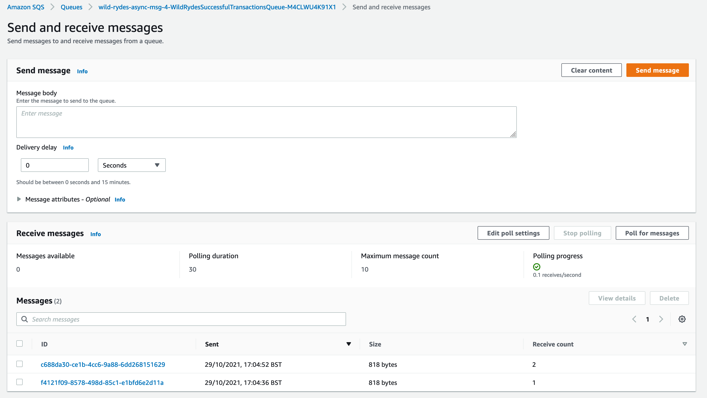

+++
title = "Executing and Testing"
weight = 55
pre = "6 "
+++

#### Executing the state machine

To begin testing your application, open the state machine and click **Start execution**

Copy and paste the fare payload into the Input field and click **Start Execution**. An execution will be successful if you invoke it with the following payload (you are free to update the values):


{
  "customerId": "3",
  "fareId": "wr_563",
  "fareAmount": "$20.00",
  "cc": "2424 2424 2424 2424",
  "expiryDate": "12/22",
  "cvv": "111"
}


#### Testing failures

You can easily force custom exceptions from the Lambda functions by appending one of the following suffixes to the `customerId`. For example, if you want to test to see if your state machine is handling pre-authentication failures for the ChargeFare state, simply append `_fail_auth` to the `customerId` like so...


{
  "customerId": "3_fail_auth",
  "fareId": "wr_563",
  "fareAmount": "$20.00",
  "cc": "2424 2424 2424 2424",
  "expiryDate": "12/22",
  "cvv": "111"
}


| State | customerId Suffix | Exception
| ------ | ----------- | ---------- |
| ChargeFare | _fail_auth | PaymentAuthException|
| ChargeFare | _fail_charge | PaymentChargeException |
| CustomerAccountCredit | _fail_credit | AccountCreditException |

Here are some examples of the execution path your state machine will have when errors are invoked, and what a successful execution path looks like. 

#### Examining Notifications

You can examine success and failed notifications that are consumed from the SNS Topic by the respective SQS queues. Navigate to the [SQS Console](https://console.aws.amazon.com/sqs/) and look at **messages available**. 

You can also click on one the queues and then click on the **Send and Receive messages** to then Receive messages and examine the content and attributes for the notification messages sent by the State machine. Notice that these messages contain the JSON state we propagated from each state. We can easily transform this JSON in Step Functions using JSON Path if needed.

