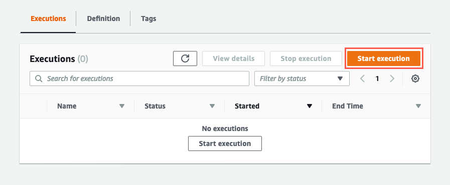
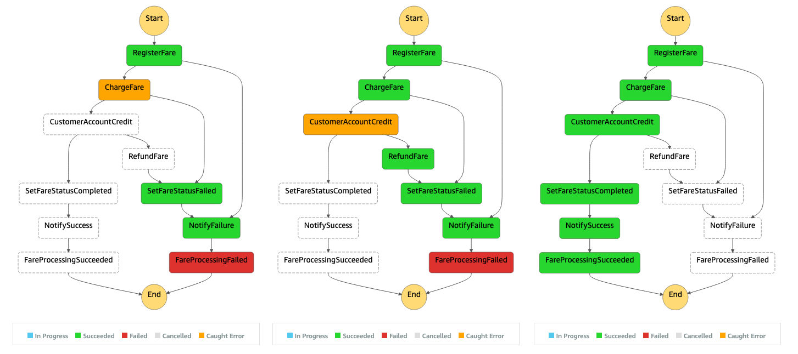

+++
title = "Executing and Testing"
weight = 53
pre = "3 "
+++

#### Executing the state machine

To begin testing your application, open the state machine and click **Start execution**

Copy and paste the fare payload into the Input field and click **Start Execution**. An execution will be successful if you invoke it with the following payload (you are free to update the values):


{
  "customerId": "3",
  "fareId": "wr_563",
  "fareAmount": "$20.00",
  "cc": "2424 2424 2424 2424",
  "expiryDate": "12/22",
  "cvv": "111"
}


#### Testing failures

You can easily force custom exceptions from the Lambda functions by appending one of the following suffixes to the `customerId`. For example, if you want to test to see if your state machine is handling pre-authentication failures for the ChargeFare state, simply append `_fail_auth` to the `customerId` like so...


{
  "customerId": "3_fail_auth",
  "fareId": "wr_563",
  "fareAmount": "$20.00",
  "cc": "2424 2424 2424 2424",
  "expiryDate": "12/22",
  "cvv": "111"
}


| State | customerIs Suffix | Exception
| ------ | ----------- | ---------- |
| ChargeFare | _fail_auth | PaymentAuthException|
| ChargeFare | _fail_charge | PaymentChargeException |
| CustomerAccountCredit | _fail_credit | AccountCreditException |

Here are some examples of the execution path your state machine will have when errors are invoked, and what a successful execution path looks like. 

