+++
title = "Register and Charge Fare Workflow"
weight = 52
pre = "3 "
+++

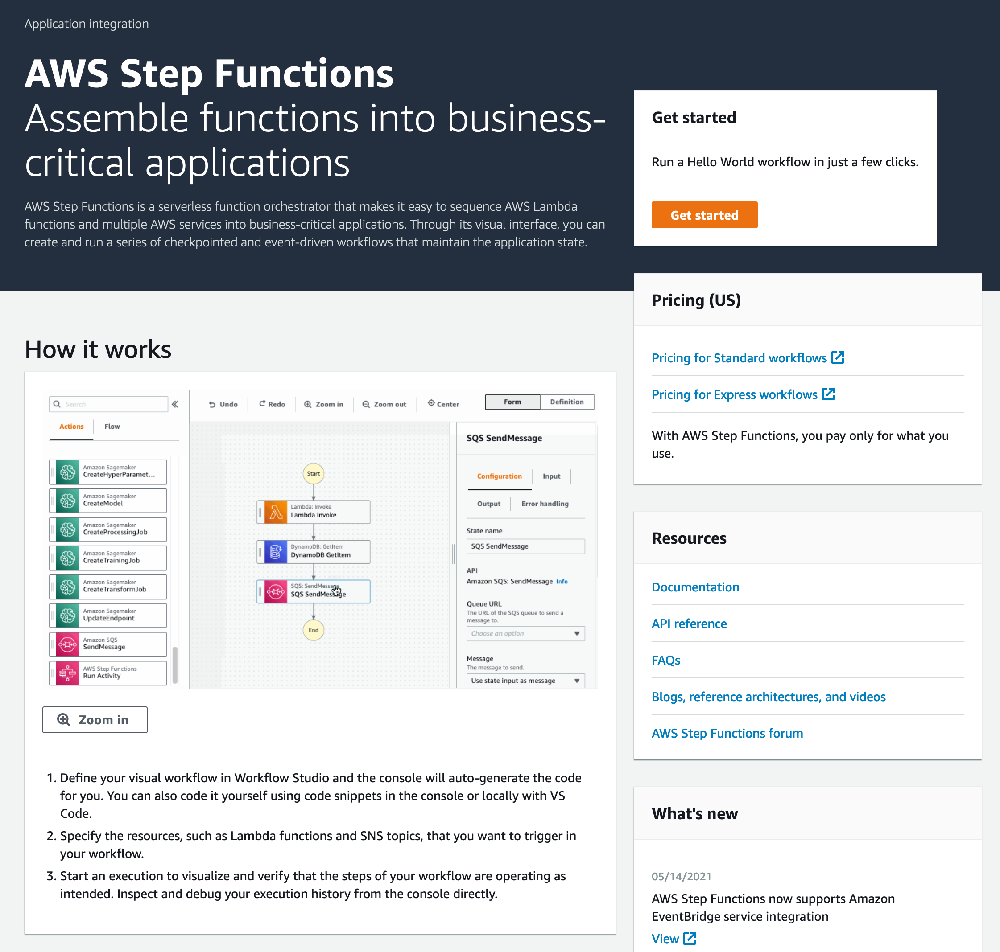

In this section of the lab, we will familiarize ourselves with the Step Functions Workflow studio and define the main transactions in our workflow. We will first assume a **'happy path'** through our system and tackle failures and possible exception paths in the next part of the lab.

#### 1. Browse to the Amazon Step Functions Console

In the [Amazon Step Functions console](https://console.aws.amazon.com/states/), click on **State machines** in the left navigation pane, select the **`wild-rydes-async-msg-4-start-here`**  state machine from the list and then click the **Edit** button.

{}

{}

#### 2. Edit the State machine using Workflow Studio

In the Step Functions Edit page, you will see the State Machine definition in the left pane and a diagram of the workflow on the right (see detailed description). 

A Step Functions State Machine is defined using the [Amazon States Language specification (ASL)](https://states-language.net/spec.html). You can see the ASL in the **Definition** pane for the State machine.

{}
Try the **Generate code snippet** dropdown in the AWS Step Function Editor in the [AWS Console](https://console.aws.amazon.com/states/home) for examples of how you can implement various states using the ASL.
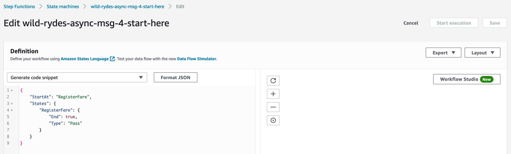
{}

In this lab we will use the Workflow Studio to create our workflow, but is important to remember that Workflow Studio will ultimately generate an underlying ASL specification for our State machine. You can view the complete generated ASL at any time by clicking on **Apply and Save** in Workflow studio and returning to the State machine Edit Definition screen.

Ensure the bootstrapped IAM role is being used (wild-rydes-msg-4-WildRydesStateMachineStartR) and click on **Workflow Studio** to proceed to the next step (refer to the screenshot in the detailed description).

{}
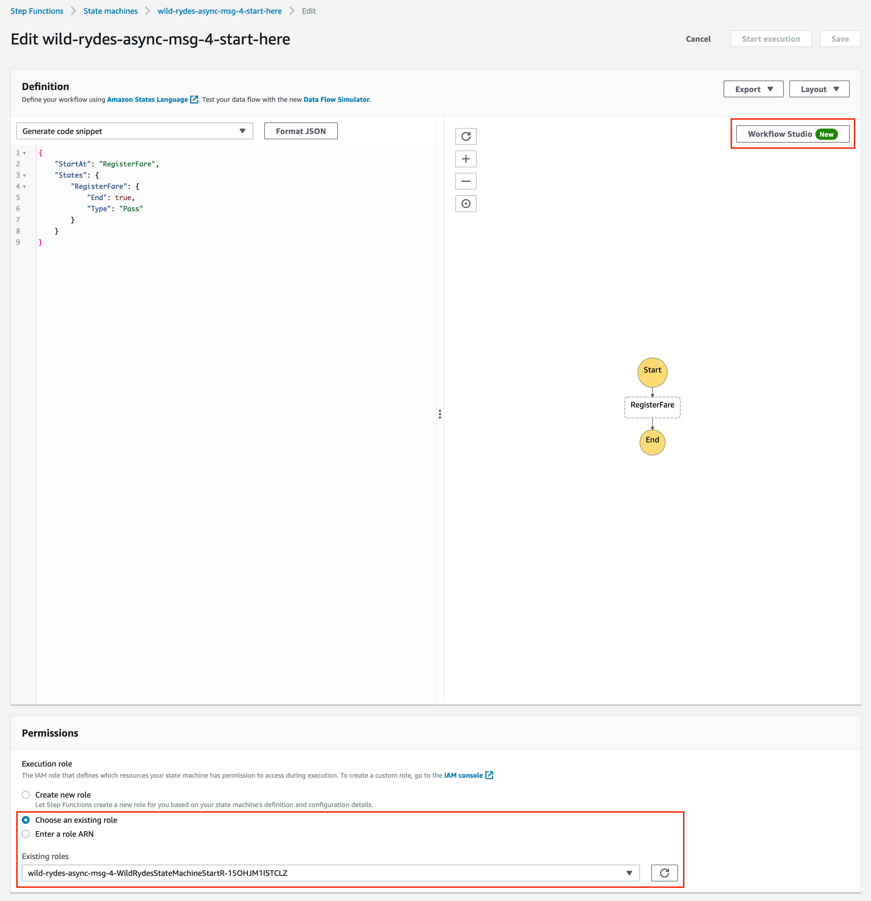
{}

#### 3. Step Functions Workflow Studio Interface

The Workflow studio is composed of three main visual components:
* The left menu pane which enables Actions and Flow states to be dragged onto the State machine.
* A graph representation of the state machine in the centre which shows the states inbetween Start and End, and how they are connected.
* A Worflow menu pane on the right-hand side that enables the properties of each state to be edited. 

{}
You can toggle between the **Form** and **Definition** views for the pane on the right-hand side of Workflow studio to toggle between a form view of the current selected state and the ASL definition. This is useful if you need to quickly generate an ASL snippet to copy into an existing State machine specification.
{}

#### 4. Add RegisterFare state

Click on the **RegisterFare** which is a Pass state and should be the only state in the starter State machine. A Pass state is a useful state to have in a State machine as a placeholder and for debugging state machines as its simply passes its input to its output. The input can be filtered or transformed or a mock output result can be added as necessary to test your state machine. Step Functions enables data to be transferred and transformed between states using JSON and JSON Path syntax. This is an important and powerful concept when developing State machines, refer to [this page in the Step Functions documentation](https://docs.aws.amazon.com/step-functions/latest/dg/concepts-input-output-filtering.html) for more information.

In the first state, we will replace the **RegisterFare** Pass State with a DynamoDB Put:Item state to add an item into the Fares Item DynamoDB table to register a new fare. 

{}
All the steps in this lab will assume that the **Form** menu is active in Workflow Studio when selecting states such that the Configuration, Input and Output submenus can be accessed.
{}

In the **Actions** menu in the left-hand pane, select **DynamoDB** from the **Database** category and drag the **PutItem** action onto the workflow graph either before or after the existing Pass State.

Click on the **RegisterFare** Pass State and click on **Delete state** from the Configuration menu. You can also right-click on the state in the graph to delete or duplicate the state.

Click on the newly added **PutItem** state and enter the following for the **Configuration**:

* **State Name**: RegisterFare
* **API Parameters**:
    
{
    "TableName": "FaresTable-wild-rydes-async-msg-4",
    "Item.$": "$"
} 
    

This targets the bootstrapped Fares table and adds an item using the entire input JSON payload by referencing $ for the item field.

We need to make sure that the original JSON input is combined with the output from this state and passed on to the next state. In the **Output** tab, ensure the **Add original input to output using ResultPath** is ticked and has the following values:

* Combine original input with result
* $.dynamodbResult

{}
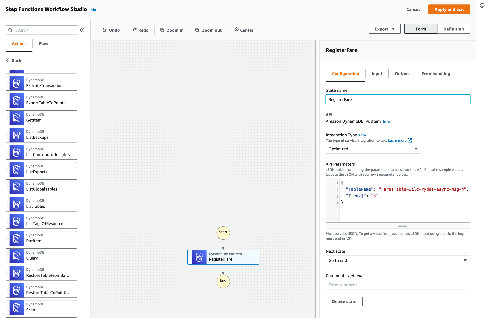
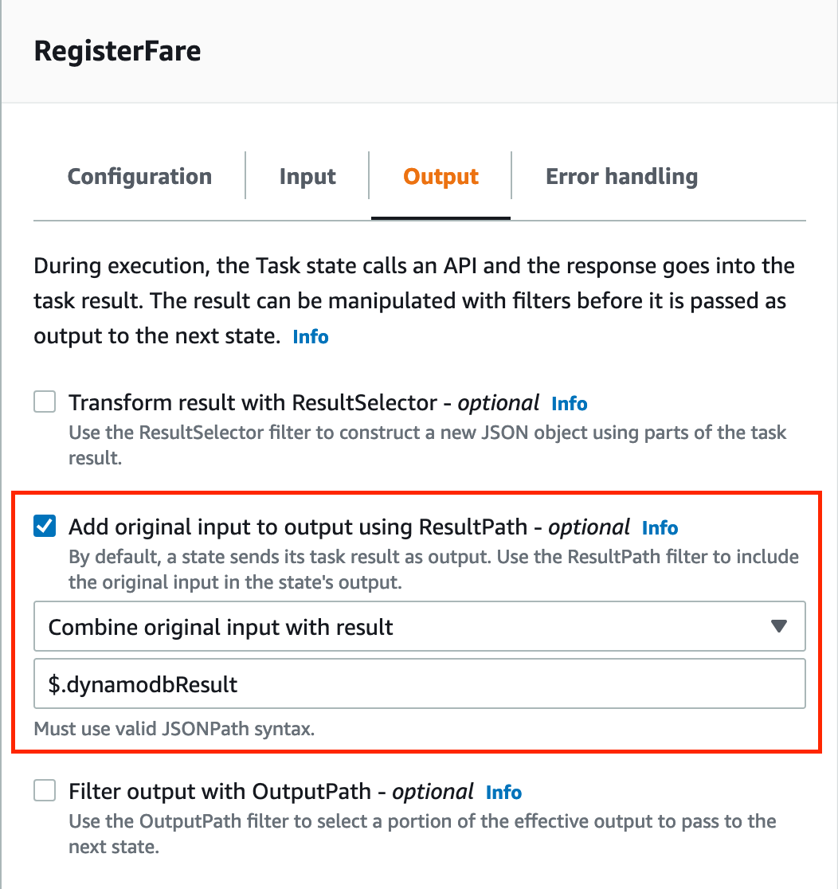
{}

#### 5. Charge Fare

Now that we have registered the fare in the system by adding it to the Fares DynamoDB table, we should attempt to charge the fare via a simulated payment system.

In the **Actions** menu, select **AWS Lambda Invoke** and drag it onto the state machine graph **after RegisterFare**. The **AWS Lambda Invoke** state can be found in the **Actions** menu either in the **Most Popular** section or in the **Compute** section.

Enter the following **Configuration**:

* **State Name**: **ChargeFare**
* **Function Name**: search for **ChargeFare** and select the bootstrapped ChargeFare lambda function. 

Leave the other parameters with default values and ensure the Integration type is set to **Optimized** for this and all Lambda invokes in this State machine.

{}
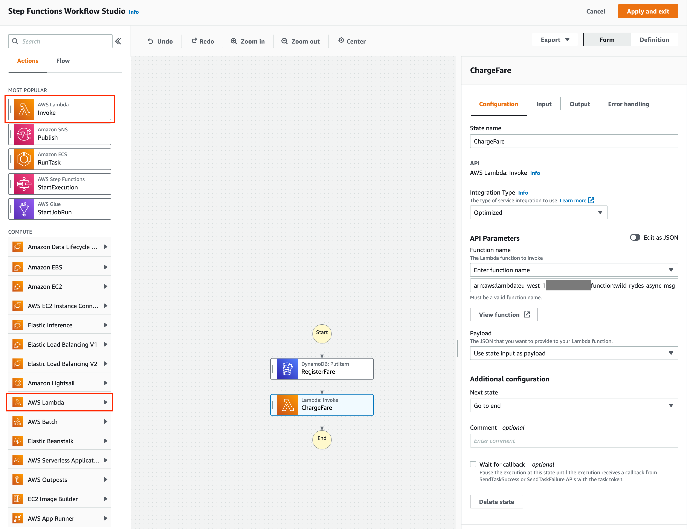
{}

#### 6. Credit Customer Account

Let's assume for now that payment has been successfully authorised by the payment system and we can move to the next stage, which is to credit the customer's account.

In the **Actions** menu, select **AWS Lambda Invoke** and drag it onto the state machine graph **after ChargeFare**. 

Set the following **Configuration**: 
* **State Name**: **CreditCustomerAccount**
* **Function name**: search for and select the bootstrapped **Account Credit** lambda function

Leave the other parameters with default values.

#### 7. Set Fare Status to Completed

Assuming a successful path through the workflow, we have now completed the fare payment and subsequent credit to the customer account, so let's update the status to completed for the Fare in the DynamoDB table.

Navigate to the DynamoDB section within the Database of the Actions menu and select **DynamoDB:UpdateItem**. Drag this action **after the CreditCustomerAccount state** and add the following for the Configuration.

* **State Name**: SetFareStatusCompleted

 
{
  "TableName": "FaresTable-wild-rydes-async-msg-4",
  "Key": {
    "fareId": {
      "S.$": "$.fareId"
    }
  },
  "UpdateExpression": "SET fareStatus = :s",
  "ExpressionAttributeValues": {
    ":s": {
      "S": "completed"
    }
  }
}
    

Finally, we need to make sure that the original JSON input is combined with the output and passed on to the next state. In the **Output** tab, ensure the **Add original input to output using ResultPath** is ticked and has the following values:

* Combine original input with result
* $.dynamodbResult

{}
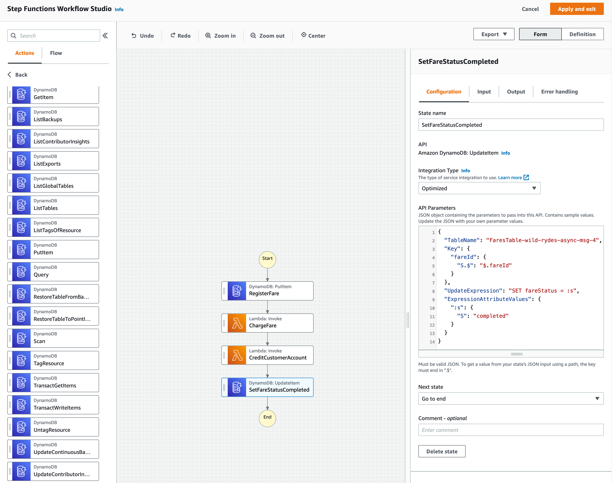
{}

#### 8. Send Success SNS Notification

Finally, let's send a successful notification message onto our SNS Topic to mark the completion of this State machine and potentially notify any interested consumers. These consumers could use any notifications from our State to complete appropriate follow on activities.

In the **Actions** menu, select **Amazon SNS Publish** from either the **Most Popular** or **Application Integration** category and drag in between **SetFareStatusCompleted** and **End**. Set the parameters to the following:

* **State Name**: NotifySuccess
* **Topic**: Search for and select the bootstrapped **FareProcessing** topic.

In the **Output** tab, ensure the **Add original input to output using ResultPath** is ticked and has the following values:

* Combine original input with result
* $.snsResult

The SNS notifications are sent to a single SNS topic that has two SQS Queue consumers for successful and failed notifications respectively. 

**Before you continue on, can you work out how these notification messages are routed to the appropriate SQS queue? Hint: Start in the [SNS Console](https://console.aws.amazon.com/sns/v3/)**.

The answer is that we have to add message attributes to our notifications to enable the appropriate SQS queue to consume the message based on the filter policies we have set.

In the **Configuration** tab for the **NotifySuccess** state, copy the topic ARN and keep to hand. Click on **Edit as JSON** under **API Parameters** and copy the following JSON replacing **arn placeholder** with the topic ARN you copied previously: 


{
  "Message.$": "$",
  "TopicArn": "<<arn placeholder>>",
  "MessageAttributes": {
    "IsSuccessful": {
      "DataType": "String",
      "StringValue": "true"
    }
  }
}

{}
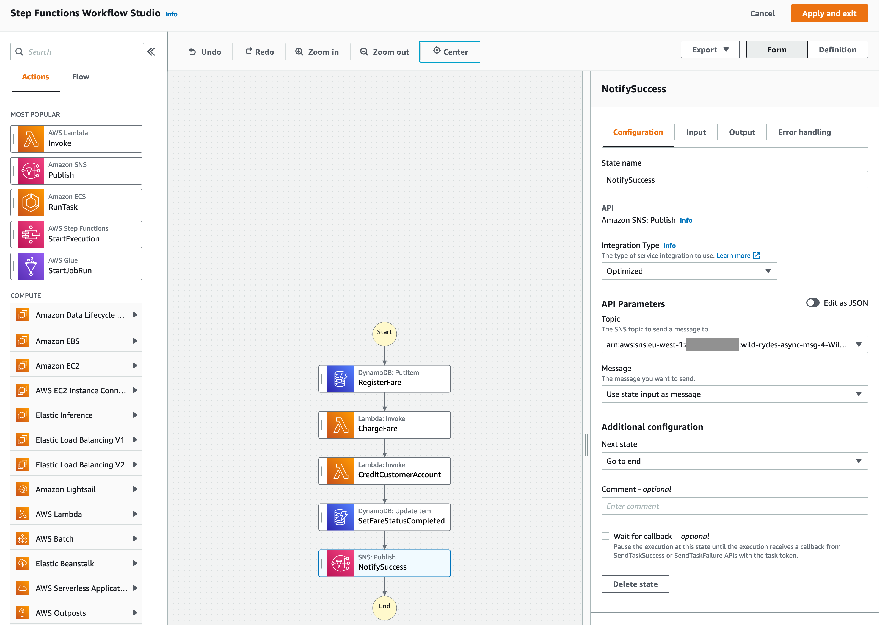
{}
#### 9. Initial Register and Charge Fare Workflow Complete

This completes our initial workflow and this part of the lab. At this stage, you should have a workflow that registers and charges a fare, credits a customer account and finally sets the fare status to completed. This adds all the transactions from the overview at the start of this lab. 

Refer to the Detailed Description below for a graph of the workflow you should have at this stage.

{}
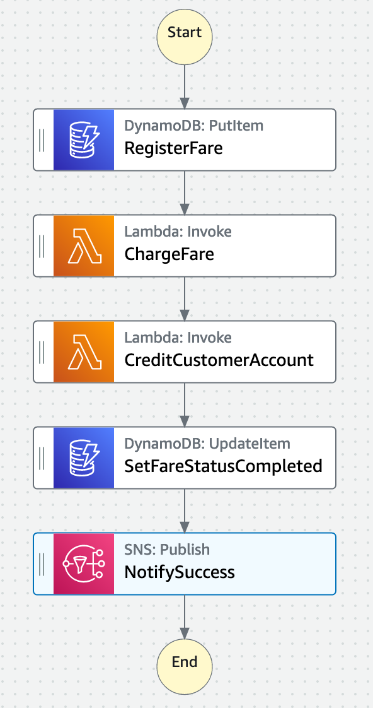
{}

{}
Don't forget to click **Apply and exit** in Workflow Studio followed by **Save** on the Edit screen before you leave the console or your changes will be lost. It's a two stage process because we are using Workflow Studio to generate and apply an ASL definition which we then must save for the State Machine.
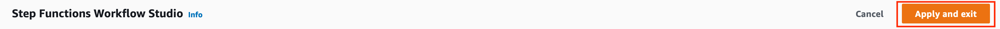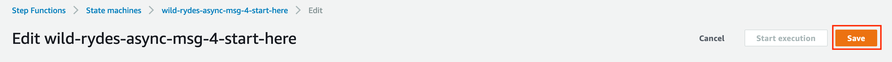
{}