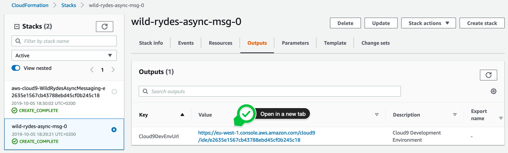
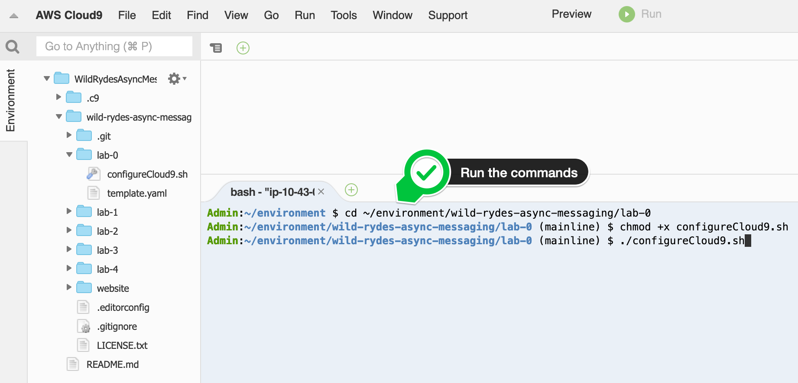

+++
title = "Configure AWS Cloud9"
weight = 12
pre = ""
+++

{}
Ad blockers, javascript disabler, and tracking blockers should be disabled for
the cloud9 domain, or connecting to the workspace might be impacted.
Cloud9 requires third-party-cookies. You can whitelist the [specific domains]( https://docs.aws.amazon.com/cloud9/latest/user-guide/troubleshooting.html#troubleshooting-env-loading).
{}

### 1. Browse to your AWS Cloud9 development environment

Open your [CloudFormation Console](https://console.aws.amazon.com/cloudformation/home?#/stacks) and select the stack at the bottom (the name could vary). The `Outputs` tab exposes the `Cloud9DevEnvUrl` parameter. Click at the corresponding URL in the value column and open your AWS Cloud9 development environment in a new tab.

{}

{}

### 2. Configure your AWS Cloud9 development environment

In your AWS Cloud9 IDE, you can close the welcome tab. In the left environment navigation window, you can see the project **wild-rydes-async-messaging** we have already checked out for you from Github. This project also contains a shell script to setup your environment. Run the following command in the **bash** tab (at the bottom of the IDE):


cd ~/environment/wild-rydes-async-messaging/lab-0
chmod +x configureCloud9.sh
./configureCloud9.sh



{}

{}

It takes usually less then 3 minutes, until the AWS Cloud9 IDE is updated. In the meantime while your waiting, you may want to have a look at some handy AWS Cloud9 shortcuts, like the **[multiple cursors](https://docs.c9.io/docs/multiple-cursors)** or the AWS Cloud9 **[keybindings](https://docs.c9.io/docs/keybindings)**.

**You are now ready to get started!!!**
