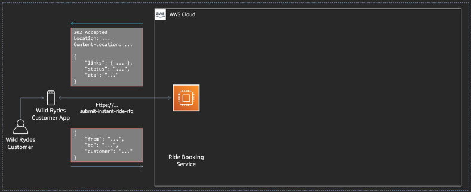
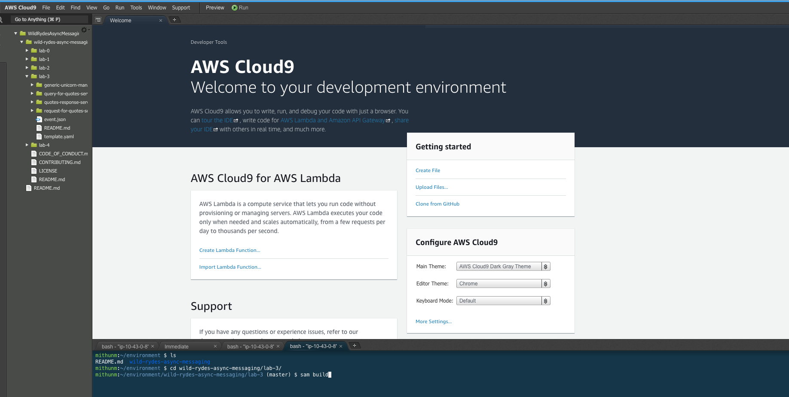

+++
title = "Bootstrap the Initial State"
weight = 41
pre = "1 "
+++

First, we will build the AWS Serverless Application Model (AWS SAM) deployment template to create the deployment package for the Python functions. AWS SAM is an open-source framework that you can use to build serverless applications on AWS. It will also generate deployment artifacts that target AWS Lambda's execution environment. It also helps with creating artifacts needed for running the tests using sam local.

The inputs and outputs from the service are shown in the picture below. The overall deployment comprises of deploying API endpoints using Amazon API Gateway to send the RFQ (request for quote) and get the response for the RFQ, AWS Lambda functions to process the request for quotes from end user and response for the quotes from service providers, Amazon DynamoDB to stage the response quotes and SQS queues to act as the message destination for request and responses.

### 1. Browse to your AWS Cloud9 IDE

Browse to your [AWS Cloud9 Console](https://console.aws.amazon.com/cloud9/home) and select the environment called **WildRydesAsyncMessaging**. Open the IDE and go to the terminal window in lower right pane.

{}

{}

### 2. Build the lab artifacts from source

We provide you with an [AWS SAM](https://aws.amazon.com/serverless/sam/) template which we will use to bootstrap the initial state. In the **bash tab** (at the bottom) in you AWS Cloud9 IDE, run the following commands to build the lab code:  


cd ~/environment/wild-rydes-async-messaging/lab-3
sam build


{}

{}

### 3. Deploy the application

Now we are ready to deploy the application, by running the following command in the **lab-3** directory:  



sam deploy \
    --guided \
    --stack-name wild-rydes-async-msg-3 \
    --capabilities CAPABILITY_IAM


Confirm all proposed arguments by hitting **ENTER**.

The application comprises of API Gateway endpoints and lambda functions which provide the ability to send request for quotes and query the responses. Service providers are subscribed to a SNS topic which is used to publish the request for quote. On receiving the RFQ message, service providers send their response for quotes in a queue. The queue triggers a lambda functions which loads the responses in a DynamoDB table. The response for quotes service queries all the responses based on request id. In a real world scenario, the service providers may respond at different times as a result client applications may need to consolidate their responses by polling responses multiple times.

### 4. Wait until the stack is successfully deployed

It usually takes less than 5 minutes until the stack launched. You can monitor the progress of the **wild-rydes-async-msg-3** stack in your [AWS CloudFormation Console](https://console.aws.amazon.com/cloudformation). When the stack is launched, the status will change from **CREATE_IN_PROGRESS** to **CREATE_COMPLETE**.

{}

{}

In the meantime while your waiting, you may want to have a look at the AWS SAM template to make yourself familiar with the stack we launched. Just click on the **template.yaml** attachment below to see the content. Once complete, you can also look at the lambda functions that will request the quotes and process responses. The created queues can also be explored from the console.

{}

