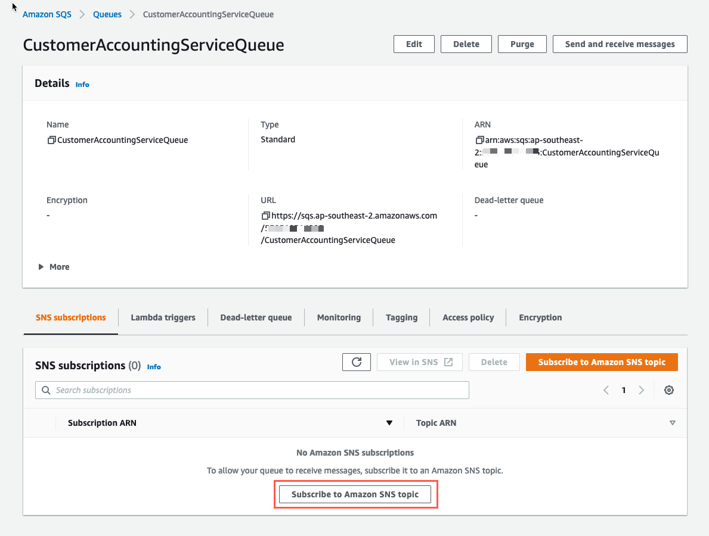
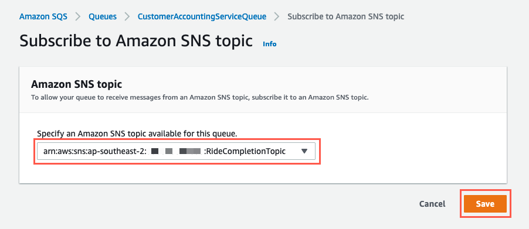
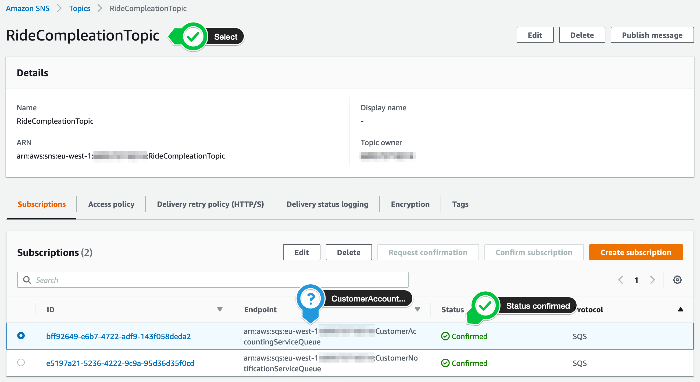
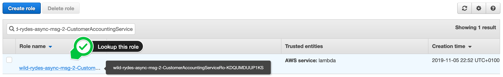
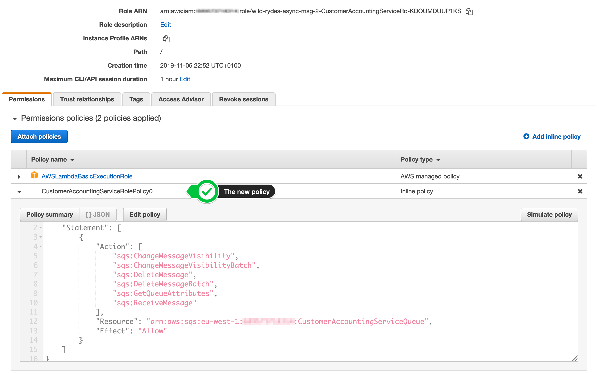
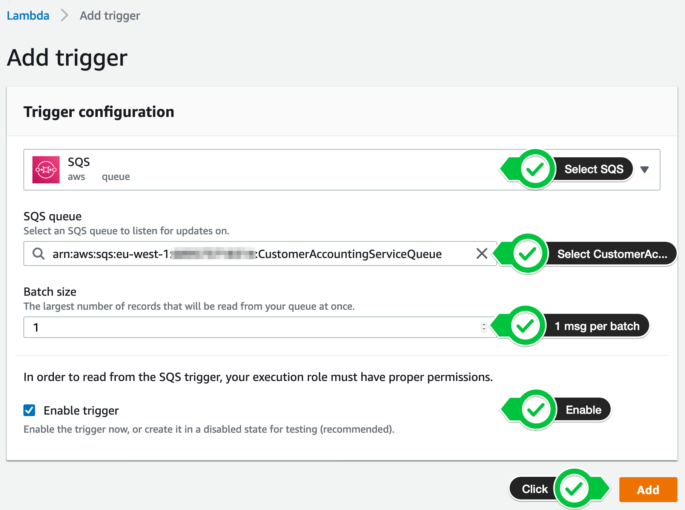
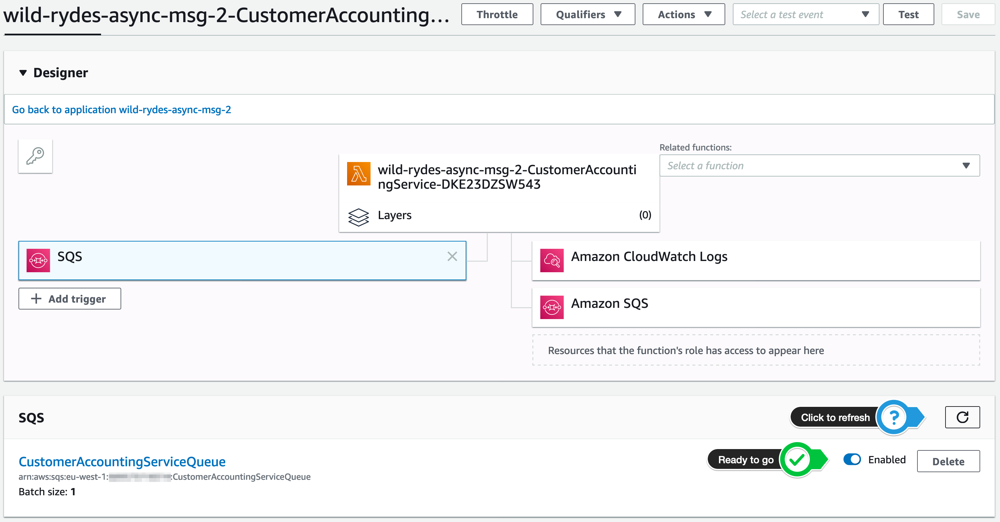

+++
title = "Console"
disableToc = true
hidden = true
+++

#### 1. Create a new Amazon SQS queue

In your **[Amazon SQS console](https://console.aws.amazon.com/sqs/home?)**, select **Create New Queue** in top left corner or click **Get Started Now** in the center of the page, if it's your first queue in this region.

{}

{}

Enter `CustomerAccountingServiceQueue` as **Queue Name**, make sure **Standard Queue** is highlighted and click **Quick-Create Queue**.

{}

{}

#### 2. Create a new subscription

After selecting the queue **CustomerAccountingServiceQueue**, click the **Queue Actions** drop down in the top left corner and chose **Subscribe Queue to SNS Topic**.

{}

{}

In the pop up window, select the **RideCompletionTopic** and click **Subscribe**. Click **Ok** in the confirmation dialog.

{}

{}

#### 3. Validate the subscription confirmation

Browse to your **[Amazon SNS console](https://console.aws.amazon.com/sns/v3/home?#/topics)** to list your existing topics. Select the **RideCompletionTopic** and verify, the subscription has the status **Confirmed**.

{}

{}


#### 4. Grant permissions to our function to access the Amazon SQS queue

In your **[Amazon IAM console](https://console.aws.amazon.com/iam)**, select **Roles** in the left navigation. Use the filter text box to find the role with the name **wild-rydes-async-msg-2-CustomerAccountingService-...** (assuming your have chosen `wild-rydes-async-msg-2` as your stack name).  

{}

{}

Click on the role name and click **Add inline policy** to attache another one.

{}

{}

Select the **JSON** tab and passed the following policy statement into it, after you have substitute <<...>> with the correct values. It will add the permission to your Lambda function to access the Amazon SQS queue:

{}
```bash
{
    "Statement": [
        {
            "Effect": "Allow",
            "Action": [
                "sqs:ChangeMessageVisibility",
                "sqs:ChangeMessageVisibilityBatch",
                "sqs:DeleteMessage",
                "sqs:DeleteMessageBatch",
                "sqs:GetQueueAttributes",
                "sqs:ReceiveMessage"
            ],
            "Resource": "arn:aws:sqs:<<AWS REGION>>:<<AWS ACCOUNT ID>>:CustomerAccountingServiceQueue"
        }
    ]
}
```
{}

{}
Make sure you provide the AWS ACCOUNT ID in the form of XXXXXXXXXXXX and not XXXX-XXXX-XXXX!
{}

Click **Review policy** and enter the **Name** `CustomerAccountingServiceRolePolicy0`. Click **Create policy**. To validate this step, select on the role again and your should see 3 policies attached to your role, including the one you just have created:  

{}

{}


#### 5. Add the Amazon SQS queue as event source for your Customer Accounting Service AWS Lambda function

Open your **[AWS Lambda console](https://console.aws.amazon.com/lambda/home?#/functions)** and select **Functions** in the left navigation. Click on the function with the name **wild-rydes-async-msg-2-CustomerAccounting...** (assuming your have chosen `wild-rydes-async-msg-2` as your stack name). Click on the **+ Add Trigger** button on the left side of the page:

{}

{}

On the following page, select `SQS` as the event source for this AWS Lambda function. For the **SQS queue**, select the `CustomerAccountingServiceQueue` and set the **batch size** to `1`. Don't forget to **enable the trigger**, before you click the **Add** button in the lower right corner.

{}

{}

After some seconds, the trigger will be enabled and and you are ready to go (you may have to refresh the site a few times).

{}

{}
