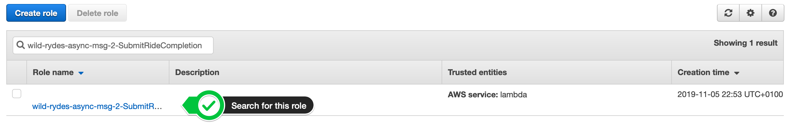
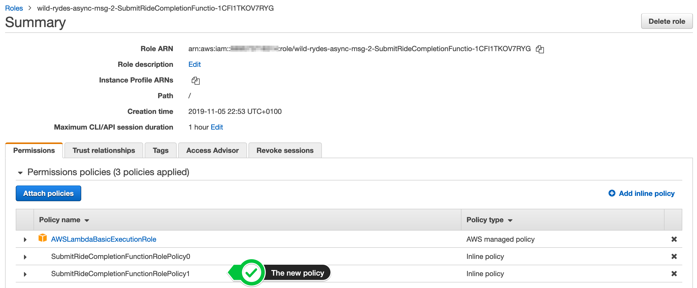
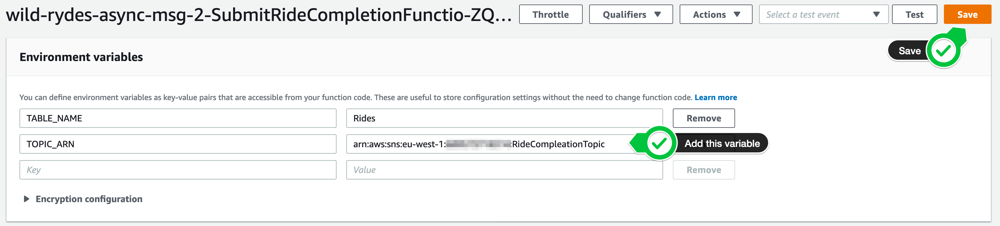

+++
title = "Console"

disableToc = true
hidden = true
+++

#### 1. Grant additional IAM permissions to Lambda

In your **[Amazon IAM console](https://console.aws.amazon.com/iam)**, select **Roles** in the left navigation. Use the filter text box to find the role with the name **wild-rydes-async-msg-2-SubmitRideCompletionFunctio-...** (assuming your have chosen `wild-rydes-async-msg-2` as your stack name).  

{}

{}

Click on the role name and click **Add inline policy** to attache another one.

{}

{}

Select the **JSON** tab and passed the following policy statement into it, after you have substitute <<...>> with the correct values. It will add the permission to your Lambda function to publish messages to this particular Amazon SNS topic:

{}
```json
{
    "Version": "2012-10-17",
    "Statement": [
        {
            "Action": [
                "sns:Publish"
            ],
            "Resource": "arn:aws:sns:<<AWS REGION>>:<<AWS ACCOUNT ID>>:<<SNS TOPIC NAME>>",
            "Effect": "Allow"
        }
    ]
}
```
{}

{}
Make sure you provide the AWS ACCOUNT ID in the form of XXXXXXXXXXXX and not XXXX-XXXX-XXXX!
{}

Click **Review policy** and enter the **Name** `SubmitRideCompletionFunctionRolePolicy1`. Click **Create policy**. To validate this step, select on the role again and your should see 2 policies attached to your role, including the one you just have created:  

{}

{}

#### 2. Provide the Amazon SNS topic ARN to Lambda

In your **[AWS Lambda console](https://console.aws.amazon.com/lambda/home?#/functions)**, select **Functions** in the left navigation. Use the filter text box to find the function with the name **wild-rydes-async-msg-2-SubmitRideCompletionFunctio-...** (assuming your have chosen `wild-rydes-async-msg-2` as your stack name).  

{}

{}

Click on the function name and scroll down to the section **Environment variables**. Our Lambda function expects an environment variable with the **Name** `TOPIC_ARN`. It uses this Amazon SNS topic to publish all messages to. Lookup your Amazon SNS topic name in the [Amazon SNS console](https://console.aws.amazon.com/sns) and add this variable. Click the **Save** button in the top right corner to save the change.  

{}

{}


#### 3. Update your Lambda function to call Amazon SNS

Open your **[AWS Lambda console](https://console.aws.amazon.com/lambda/home?#/functions)** and select **Functions** in the left navigation. Select the function with the name **wild-rydes-async-msg-2-SubmitRideCompletionFunctio-...** (assuming your have chosen `wild-rydes-async-msg-2` as your stack name). Scroll a bit down to the section **Function code**. Add the definition of the sns client directly after the dynamodb client:  

{}
```Python
sns = boto3.client('sns', config=config)
```
{} 

After the put item DynamoDB statement and before we are sending the response back to the caller, add the code to publish a message to Amazon SNS:  

{}
```Python
    response = sns.publish(
        TopicArn=TOPIC_ARN,
        Message=json.dumps(request),
        MessageAttributes = {
            'fare': {
                'DataType': 'Number',
                'StringValue': str(request['fare'])
            },
            'distance': {
                'DataType': 'Number',
                'StringValue': str(request['distance'])
            }
        }
    )
```
{}

{}

{}

{}
**Using AWS Lambda Layers**  
If you are wondering why the uploaded AWS Lambda function archive is less then 1 kB, but it requires boto3 to run, here comes the answer. We are using a custom AWS Lambda layer with Python 3.6 and boto3 1.9.248. To create this layer, we only run the script below in our 'lambda-layers' sub-folder. In our AWS SAM template, we make use of this zip file to create the layer. Stay curious and have a look into the file 'wild-rydes-async-messaging/lab-1/template.yaml'.
```bash
pipenv --python 3.6
pipenv shell
pipenv install boto3
PY_DIR='build/python/lib/python3.6/site-packages'
mkdir -p $PY_DIR
pipenv lock -r > requirements.txt
pip install -r requirements.txt --no-deps -t $PY_DIR
cd build
zip -r ../python_layer_with_boto3.zip .
cd ..
rm -r build
```
{}
