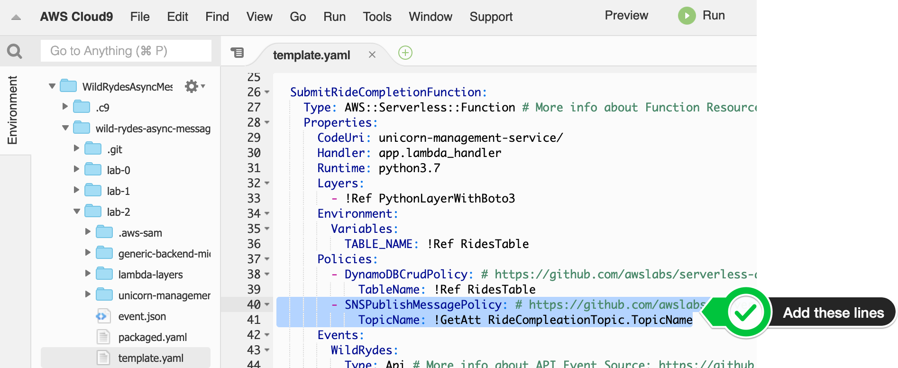
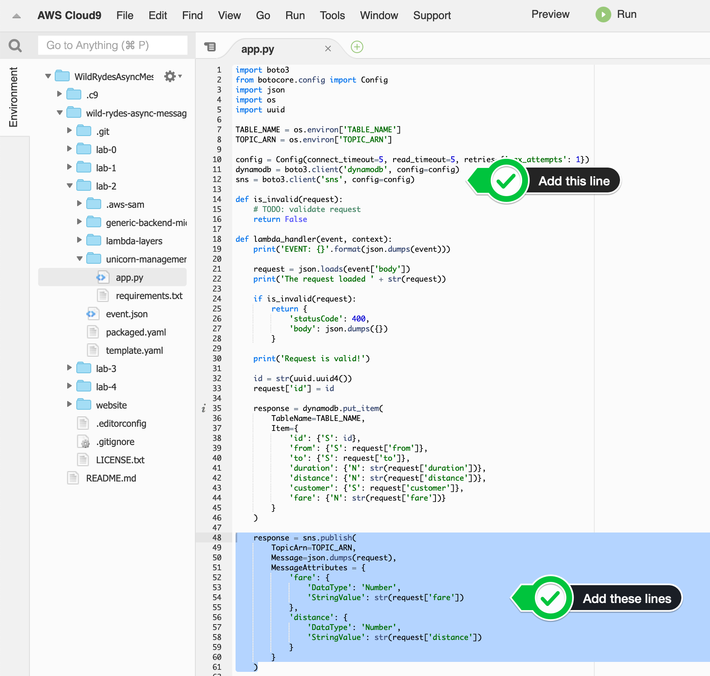

+++
title = "SAM"

disableToc = true
hidden = true
+++

#### 1. Grant additional IAM permissions to Lambda

In your Cloud9 IDE for this workshop, open the SAM template file `wild-rydes-async-messaging/lab-2/template.yaml`. In the **Resources** section, look for the **SubmitRideCompletionFunction** definition. It already contains one policies entry called **DynamoDBCrudPolicy**. Directly below, add a policy entry which grants Amazon SNS publish message permission. You can look up the supported policies **[here](https://docs.aws.amazon.com/serverless-application-model/latest/developerguide/serverless-policy-templates.html)**.

{}

```yaml
        - SNSPublishMessagePolicy:
            TopicName: !GetAtt RideCompletionTopic.TopicName
```

{}

{}

{}


#### 2. Provide the Amazon SNS topic ARN to Lambda

In your Cloud9 IDE for this workshop, open the SAM template file `wild-rydes-async-messaging/lab-2/template.yaml`. In the **Resources** section, look for the **SubmitRideCompletionFunction** definition. It already contains one environment variables entry called **TABLE_NAME**. Directly below, add an additional variable with the key **TOPIC_ARN** and the corresponding value.  

{}

```yaml
          TOPIC_ARN: !Ref RideCompletionTopic
```

{} 

{}

{}


#### 3. Update your Lambda function to call Amazon SNS

In your Cloud9 IDE, open the Python based AWS Lambda function `wild-rydes-async-messaging/lab-2/unicorn-management-service/app.py`.  
Add the definition of the sns client directly after the dynamodb client:  

{}
```Python
sns = boto3.client('sns', config=config)
```
{}

After the put item DynamoDB statement and before we are sending the response back to the caller, add the code to publish a message to Amazon SNS:  

{}
```Python
    response = sns.publish(
        TopicArn=TOPIC_ARN,
        Message=json.dumps(request),
        MessageAttributes = {
            'fare': {
                'DataType': 'Number',
                'StringValue': str(request['fare'])
            },
            'distance': {
                'DataType': 'Number',
                'StringValue': str(request['distance'])
            }
        }
    )
```
{} 

{}

{}


#### 4. Deploy the updated AWS SAM template

Run the following command to build the lab again, after we have added the additional policy:


cd ~/environment/wild-rydes-async-messaging/code/lab-2
sam build



Now we are ready to update the application, by running the following command to deploy the change:  


sam deploy \
    --guided \
    --stack-name wild-rydes-async-msg-2 \
    --capabilities CAPABILITY_IAM


In the meantime while your waiting, you may want to have a look at the AWS SAM template to make yourself familiar with the stack we launched. Just click on the **template.yaml** attachment below to see the content.

Because AWS SAM will only deploy/update/delete resources which are changed, it only takes a couple of seconds to deploy the new version.
